# Relationship Map

_Generated by `scripts/generate-relationship-map.js` from the cross-reference fields on the Evidence, Chronology, Contradiction, Open Question, and Investigation Thread registers (spec section 14). This file is a derived view, not a source of truth - do not hand-edit it; regenerate it instead. The live workspace's Relationship Map view (`app.js`) computes the same edges dynamically at page load; this file is a static, browsable snapshot for readers off the live site (e.g. viewing the repository directly on GitHub).*

Generated: 2026-08-11T22:59:05.982Z — 314 relationship reference(s) across 73 evidence, 33 chronology, 1 contradiction, 9 open question, 15 thread record(s).

A single graph of every relationship in the register is too dense to read, so this file has one diagram per Investigation Thread — the thread, its supporting evidence, and those evidence items' own links to chronology entries, contradictions, and open questions — plus one small diagram of dependencies between threads.

## Thread dependencies

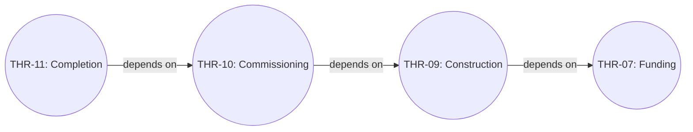

## Threads

### THR-01 — Historical failures

Status: In Progress | Completion: Not Complete

```mermaid
flowchart LR
  DFAPTI_BB_2026_00001_THRD_THR_01(("THR-01: Historical failures"))
  DFAPTI_BB_2026_00001_EVID_EV_0001["EV-0001: Kempsey's water supply now entirely reliant on rainfall"]
  DFAPTI_BB_2026_00001_EVID_EV_0002["EV-0002: Willawarrin and Bellbrook return to river supply after months of trucked-in water (media r"]
  DFAPTI_BB_2026_00001_EVID_EV_0003["EV-0003: Willawarrin and Bellbrook return to river supply after months of trucked-in water"]
  DFAPTI_BB_2026_00001_EVID_EV_0004["EV-0004: Willawarrin's new water treatment plant construction set for 2025"]
  DFAPTI_BB_2026_00001_EVID_EV_0009["EV-0009: Kempsey Shire moves to Level 2 water restrictions"]
  DFAPTI_BB_2026_00001_EVID_EV_0019["EV-0019: Early history of Willawarrin"]
  DFAPTI_BB_2026_00001_EVID_EV_0020["EV-0020: Carrai East Bushfire: 'The perfect storm' - one year on"]
  DFAPTI_BB_2026_00001_EVID_EV_0021["EV-0021: NSW bushfire Inquiry told of man who died attempting to flee his home at Willawarrin"]
  DFAPTI_BB_2026_00001_EVID_EV_0039["EV-0039: 2019-20 NSW Bushfires Coronial Inquiry, Volume 1 (Findings and Recommendations)"]
  DFAPTI_BB_2026_00001_EVID_EV_0043["EV-0043: Bellbrook"]
  DFAPTI_BB_2026_00001_EVID_EV_0044["EV-0044: Bellbrook"]
  DFAPTI_BB_2026_00001_EVID_EV_0045["EV-0045: Bellbrook"]
  DFAPTI_BB_2026_00001_CHRO_CHR_0001["CHR-0001: By this date, Willawarrin is already receiving trucked water due to iron/manganese levels "]
  DFAPTI_BB_2026_00001_CHRO_CHR_0002["CHR-0002: Willawarrin and Bellbrook are switched back to river water supply, ending several months o"]
  DFAPTI_BB_2026_00001_QUES_Q_0002{{"Q-0002: What is Bellbrook's water supply/treatment status independent of Willawarrin since 2020 - "}}
  DFAPTI_BB_2026_00001_CHRO_CHR_0003["CHR-0003: The water treatment infrastructure later replaced by the new 2025 plant is reported as hav"]
  DFAPTI_BB_2026_00001_CHRO_CHR_0004["CHR-0004: LC Water is reported as having been awarded the design-and-construction contract for the n"]
  DFAPTI_BB_2026_00001_QUES_Q_0003{{"Q-0003: Why did the Willawarrin plant's projected cost rise from approximately $4 million (reporte"}}
  DFAPTI_BB_2026_00001_QUES_Q_0004{{"Q-0004: Is the change in Kempsey Shire Council Mayor between August 2024 (Leo Hauville, per EV-000"}}
  DFAPTI_BB_2026_00001_CHRO_CHR_0007["CHR-0007: Kempsey Shire Council moves to Level 2 water restrictions amid minimal forecast rainfall a"]
  DFAPTI_BB_2026_00001_CHRO_CHR_0014["CHR-0014: Amid the Carrai East Bushfire (accelerating from 8 November 2019, during Kempsey's driest "]
  DFAPTI_BB_2026_00001_CHRO_CHR_0015["CHR-0015: A Willawarrin resident is seen exiting his vehicle to open a gate providing access to Armi"]
  DFAPTI_BB_2026_00001_CHRO_CHR_0027["CHR-0027: Bellbrook's raw (ground)water supply becomes contaminated by heavy metals and arsenic from"]
  DFAPTI_BB_2026_00001_CHRO_CHR_0028["CHR-0028: Water has to be trucked into Bellbrook because the town's water supply is too contaminated"]
  DFAPTI_BB_2026_00001_THRD_THR_01 -- "supported by" --> DFAPTI_BB_2026_00001_EVID_EV_0001
  DFAPTI_BB_2026_00001_THRD_THR_01 -- "supported by" --> DFAPTI_BB_2026_00001_EVID_EV_0002
  DFAPTI_BB_2026_00001_THRD_THR_01 -- "supported by" --> DFAPTI_BB_2026_00001_EVID_EV_0003
  DFAPTI_BB_2026_00001_THRD_THR_01 -- "supported by" --> DFAPTI_BB_2026_00001_EVID_EV_0004
  DFAPTI_BB_2026_00001_THRD_THR_01 -- "supported by" --> DFAPTI_BB_2026_00001_EVID_EV_0009
  DFAPTI_BB_2026_00001_THRD_THR_01 -- "supported by" --> DFAPTI_BB_2026_00001_EVID_EV_0019
  DFAPTI_BB_2026_00001_THRD_THR_01 -- "supported by" --> DFAPTI_BB_2026_00001_EVID_EV_0020
  DFAPTI_BB_2026_00001_THRD_THR_01 -- "supported by" --> DFAPTI_BB_2026_00001_EVID_EV_0021
  DFAPTI_BB_2026_00001_THRD_THR_01 -- "supported by" --> DFAPTI_BB_2026_00001_EVID_EV_0039
  DFAPTI_BB_2026_00001_THRD_THR_01 -- "supported by" --> DFAPTI_BB_2026_00001_EVID_EV_0043
  DFAPTI_BB_2026_00001_THRD_THR_01 -- "supported by" --> DFAPTI_BB_2026_00001_EVID_EV_0044
  DFAPTI_BB_2026_00001_THRD_THR_01 -- "supported by" --> DFAPTI_BB_2026_00001_EVID_EV_0045
  DFAPTI_BB_2026_00001_EVID_EV_0001 -- "supports" --> DFAPTI_BB_2026_00001_CHRO_CHR_0001
  DFAPTI_BB_2026_00001_EVID_EV_0002 -- "supports" --> DFAPTI_BB_2026_00001_CHRO_CHR_0002
  DFAPTI_BB_2026_00001_EVID_EV_0002 -- "involved in" --> DFAPTI_BB_2026_00001_QUES_Q_0002
  DFAPTI_BB_2026_00001_EVID_EV_0003 -- "supports" --> DFAPTI_BB_2026_00001_CHRO_CHR_0002
  DFAPTI_BB_2026_00001_EVID_EV_0003 -- "involved in" --> DFAPTI_BB_2026_00001_QUES_Q_0002
  DFAPTI_BB_2026_00001_EVID_EV_0004 -- "supports" --> DFAPTI_BB_2026_00001_CHRO_CHR_0003
  DFAPTI_BB_2026_00001_EVID_EV_0004 -- "supports" --> DFAPTI_BB_2026_00001_CHRO_CHR_0004
  DFAPTI_BB_2026_00001_EVID_EV_0004 -- "involved in" --> DFAPTI_BB_2026_00001_QUES_Q_0003
  DFAPTI_BB_2026_00001_EVID_EV_0004 -- "involved in" --> DFAPTI_BB_2026_00001_QUES_Q_0004
  DFAPTI_BB_2026_00001_EVID_EV_0009 -- "supports" --> DFAPTI_BB_2026_00001_CHRO_CHR_0007
  DFAPTI_BB_2026_00001_EVID_EV_0020 -- "supports" --> DFAPTI_BB_2026_00001_CHRO_CHR_0014
  DFAPTI_BB_2026_00001_EVID_EV_0021 -- "supports" --> DFAPTI_BB_2026_00001_CHRO_CHR_0015
  DFAPTI_BB_2026_00001_EVID_EV_0039 -- "supports" --> DFAPTI_BB_2026_00001_CHRO_CHR_0014
  DFAPTI_BB_2026_00001_EVID_EV_0039 -- "supports" --> DFAPTI_BB_2026_00001_CHRO_CHR_0015
  DFAPTI_BB_2026_00001_EVID_EV_0043 -- "supports" --> DFAPTI_BB_2026_00001_CHRO_CHR_0027
  DFAPTI_BB_2026_00001_EVID_EV_0044 -- "supports" --> DFAPTI_BB_2026_00001_CHRO_CHR_0028
  DFAPTI_BB_2026_00001_EVID_EV_0044 -- "involved in" --> DFAPTI_BB_2026_00001_QUES_Q_0002
```

### THR-02 — Trucked water

Status: In Progress | Completion: Not Complete

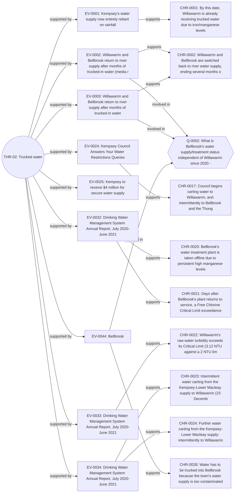

### THR-03 — Iron contamination

Status: In Progress | Completion: Not Complete

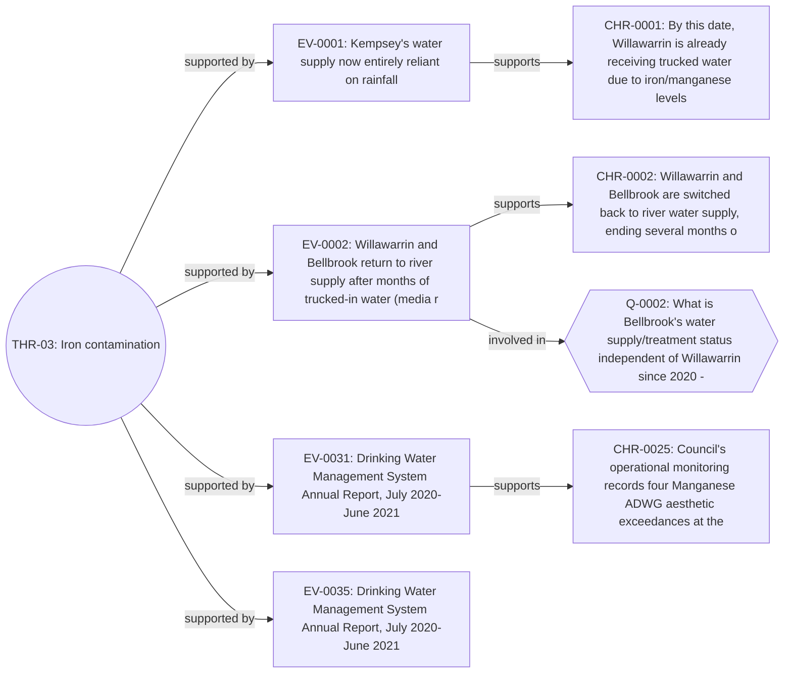

### THR-04 — Manganese contamination

Status: In Progress | Completion: Not Complete

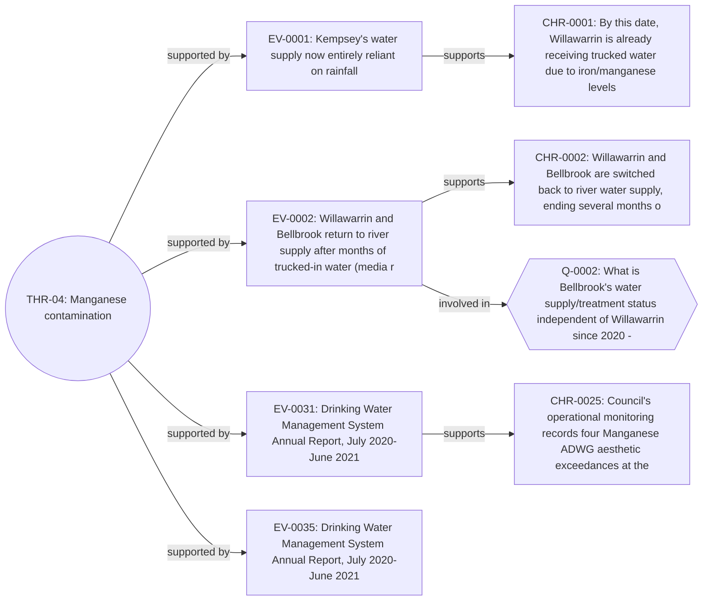

### THR-05 — River conditions

Status: In Progress | Completion: Not Complete

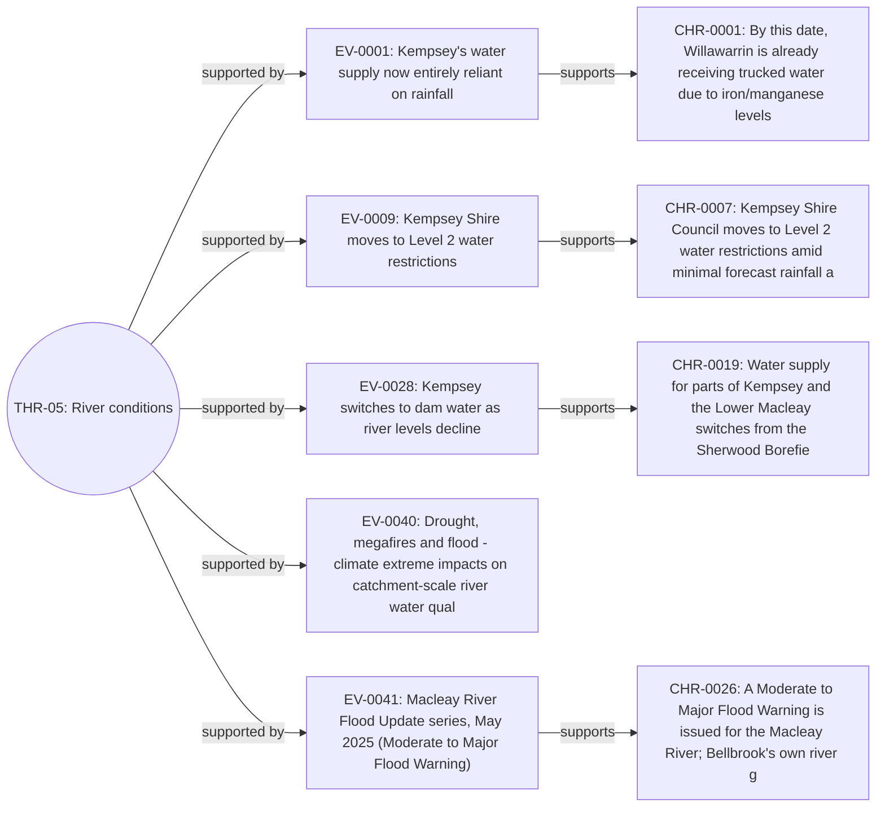

### THR-06 — Extraction decisions

Status: In Progress | Completion: Not Complete

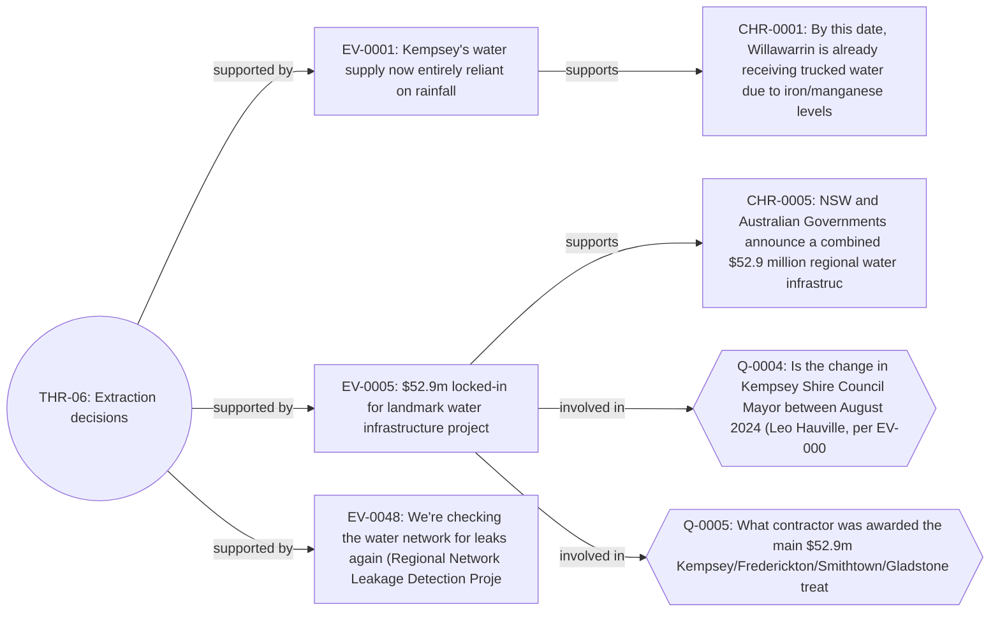

### THR-07 — Funding

Status: In Progress | Completion: Not Complete

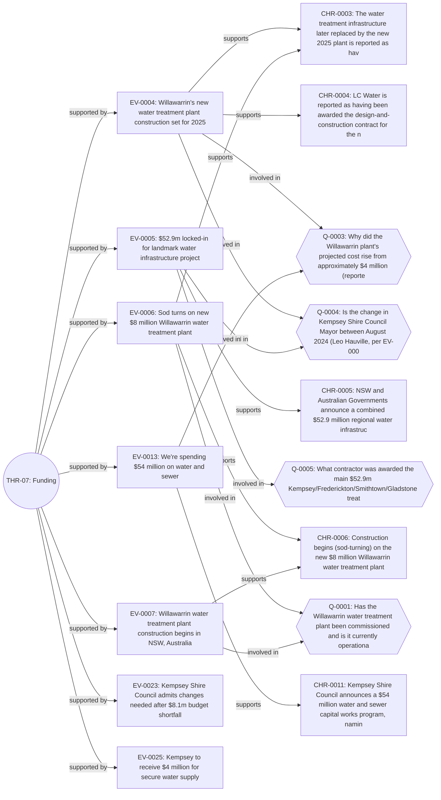

### THR-08 — Treatment plant

Status: In Progress | Completion: Not Complete

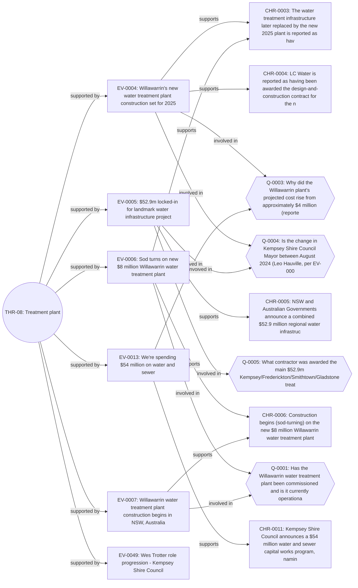

### THR-09 — Construction

Status: In Progress | Completion: Not Complete

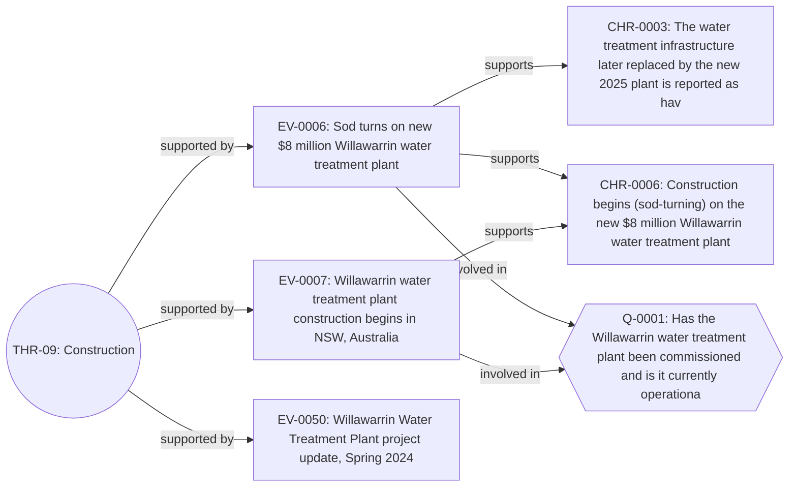

### THR-10 — Commissioning

Status: In Progress | Completion: Not Complete

_No linked evidence recorded yet for this thread._

### THR-11 — Completion

Status: Not Started | Completion: Not Complete

_No linked evidence recorded yet for this thread._

### THR-12 — Current operational status

Status: In Progress | Completion: Not Complete

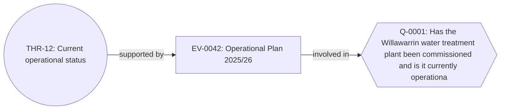

### THR-13 — Regional water security funding program (Steuart McIntyre Dam / Sherwood Borefield)

Status: In Progress | Completion: Not Complete

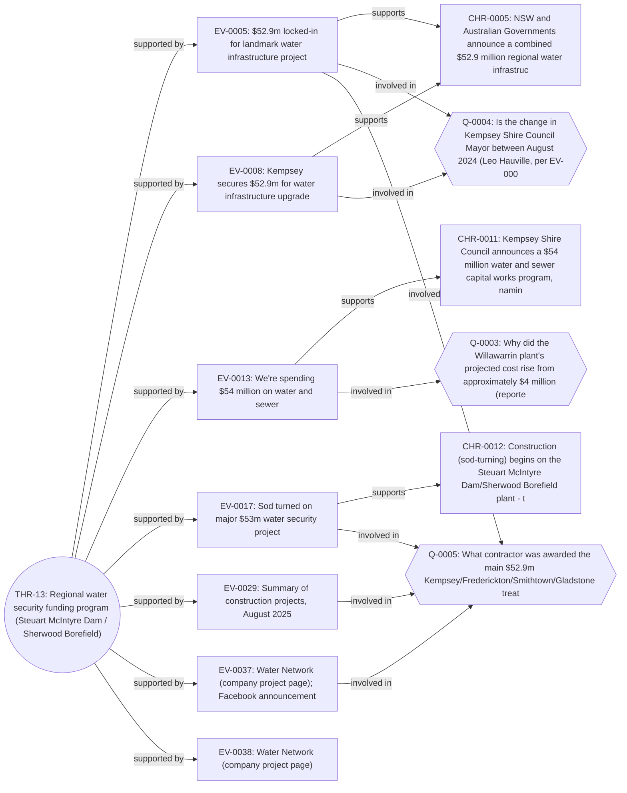

### THR-14 — Bellbrook-specific infrastructure status

Status: In Progress | Completion: Not Complete

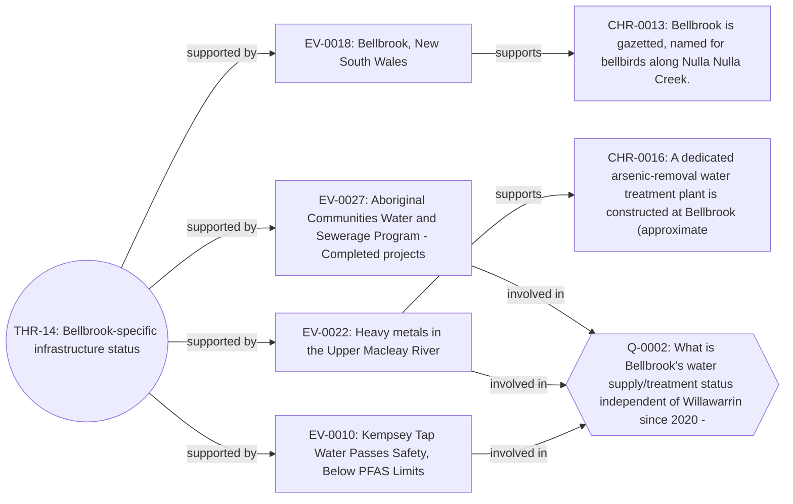

### THR-15 — Kempsey Shire Council leadership timeline (evidence-attribution context)

Status: Complete | Completion: Complete

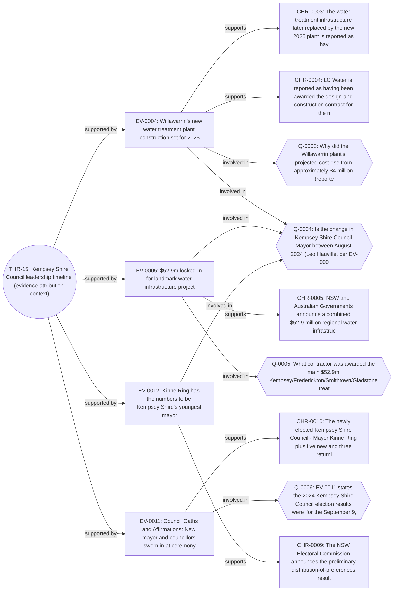
