# Relationship Map

_Generated by `scripts/generate-relationship-map.js` from the cross-reference fields on the Evidence, Chronology, Contradiction, Open Question, and Investigation Thread registers (spec section 14), independently per case (`scripts/case-registry.js`). This file is a derived view, not a source of truth - do not hand-edit it; regenerate it instead. Each case's own live workspace Relationship Map view (`app.js`) computes the same edges dynamically at page load, scoped to that case; this file is a static, browsable snapshot across every case for readers off the live site (e.g. viewing the repository directly on GitHub).*

Generated: 2026-08-22T17:10:45.593Z

A single graph of every relationship in a register is too dense to read, so each case below has one diagram per Investigation Thread - the thread, its supporting evidence, and those evidence items' own links to chronology entries, contradictions, and open questions - plus one small diagram of dependencies between threads.

## Case: DFAPTI-BB-2026-00001

325 relationship reference(s) across 75 evidence, 33 chronology, 2 contradiction, 9 open question, 15 thread record(s).

### Thread dependencies

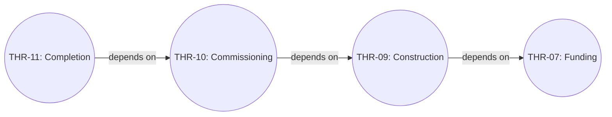
```mermaid
flowchart LR
  DFAPTI_BB_2026_00001_THRD_THR_09(("THR-09: Construction"))
  DFAPTI_BB_2026_00001_THRD_THR_07(("THR-07: Funding"))
  DFAPTI_BB_2026_00001_THRD_THR_10(("THR-10: Commissioning"))
  DFAPTI_BB_2026_00001_THRD_THR_11(("THR-11: Completion"))
  DFAPTI_BB_2026_00001_THRD_THR_09 -- "depends on" --> DFAPTI_BB_2026_00001_THRD_THR_07
  DFAPTI_BB_2026_00001_THRD_THR_10 -- "depends on" --> DFAPTI_BB_2026_00001_THRD_THR_09
  DFAPTI_BB_2026_00001_THRD_THR_11 -- "depends on" --> DFAPTI_BB_2026_00001_THRD_THR_10
```

### Threads

#### THR-01 — Historical failures

Status: In Progress | Completion: Not Complete

```mermaid
flowchart LR
  DFAPTI_BB_2026_00001_THRD_THR_01(("THR-01: Historical failures"))
  DFAPTI_BB_2026_00001_EVID_EV_0001["EV-0001: Kempsey's water supply now entirely reliant on rainfall"]
  DFAPTI_BB_2026_00001_EVID_EV_0002["EV-0002: Willawarrin and Bellbrook return to river supply after months of trucked-in water (media r"]
  DFAPTI_BB_2026_00001_EVID_EV_0003["EV-0003: Willawarrin and Bellbrook return to river supply after months of trucked-in water"]
  DFAPTI_BB_2026_00001_EVID_EV_0004["EV-0004: Willawarrin's new water treatment plant construction set for 2025"]
  DFAPTI_BB_2026_00001_EVID_EV_0009["EV-0009: Kempsey Shire moves to Level 2 water restrictions"]
  DFAPTI_BB_2026_00001_EVID_EV_0019["EV-0019: Early history of Willawarrin"]
  DFAPTI_BB_2026_00001_EVID_EV_0020["EV-0020: Carrai East Bushfire: 'The perfect storm' - one year on"]
  DFAPTI_BB_2026_00001_EVID_EV_0021["EV-0021: NSW bushfire Inquiry told of man who died attempting to flee his home at Willawarrin"]
  DFAPTI_BB_2026_00001_EVID_EV_0039["EV-0039: 2019-20 NSW Bushfires Coronial Inquiry, Volume 1 (Findings and Recommendations)"]
  DFAPTI_BB_2026_00001_EVID_EV_0043["EV-0043: Bellbrook"]
  DFAPTI_BB_2026_00001_EVID_EV_0044["EV-0044: Bellbrook"]
  DFAPTI_BB_2026_00001_EVID_EV_0045["EV-0045: Bellbrook"]
  DFAPTI_BB_2026_00001_CHRO_CHR_0001["CHR-0001: By this date, Willawarrin is already receiving trucked water due to iron/manganese levels "]
  DFAPTI_BB_2026_00001_CHRO_CHR_0002["CHR-0002: Willawarrin and Bellbrook are switched back to river water supply, ending several months o"]
  DFAPTI_BB_2026_00001_QUES_Q_0002{{"Q-0002: What is Bellbrook's water supply/treatment status independent of Willawarrin since 2020 - "}}
  DFAPTI_BB_2026_00001_CHRO_CHR_0003["CHR-0003: The water treatment infrastructure later replaced by the new 2025 plant is reported as hav"]
  DFAPTI_BB_2026_00001_CHRO_CHR_0004["CHR-0004: LC Water is reported as having been awarded the design-and-construction contract for the n"]
  DFAPTI_BB_2026_00001_QUES_Q_0003{{"Q-0003: Why did the Willawarrin plant's projected cost rise from approximately $4 million (reporte"}}
  DFAPTI_BB_2026_00001_QUES_Q_0004{{"Q-0004: Is the change in Kempsey Shire Council Mayor between August 2024 (Leo Hauville, per EV-000"}}
  DFAPTI_BB_2026_00001_CHRO_CHR_0007["CHR-0007: Kempsey Shire Council moves to Level 2 water restrictions amid minimal forecast rainfall a"]
  DFAPTI_BB_2026_00001_CHRO_CHR_0014["CHR-0014: Amid the Carrai East Bushfire (accelerating from 8 November 2019, during Kempsey's driest "]
  DFAPTI_BB_2026_00001_CHRO_CHR_0015["CHR-0015: A Willawarrin resident is seen exiting his vehicle to open a gate providing access to Armi"]
  DFAPTI_BB_2026_00001_CHRO_CHR_0027["CHR-0027: Bellbrook's raw (ground)water supply becomes contaminated by heavy metals and arsenic from"]
  DFAPTI_BB_2026_00001_CHRO_CHR_0028["CHR-0028: Water has to be trucked into Bellbrook because the town's water supply is too contaminated"]
  DFAPTI_BB_2026_00001_THRD_THR_01 -- "supported by" --> DFAPTI_BB_2026_00001_EVID_EV_0001
  DFAPTI_BB_2026_00001_THRD_THR_01 -- "supported by" --> DFAPTI_BB_2026_00001_EVID_EV_0002
  DFAPTI_BB_2026_00001_THRD_THR_01 -- "supported by" --> DFAPTI_BB_2026_00001_EVID_EV_0003
  DFAPTI_BB_2026_00001_THRD_THR_01 -- "supported by" --> DFAPTI_BB_2026_00001_EVID_EV_0004
  DFAPTI_BB_2026_00001_THRD_THR_01 -- "supported by" --> DFAPTI_BB_2026_00001_EVID_EV_0009
  DFAPTI_BB_2026_00001_THRD_THR_01 -- "supported by" --> DFAPTI_BB_2026_00001_EVID_EV_0019
  DFAPTI_BB_2026_00001_THRD_THR_01 -- "supported by" --> DFAPTI_BB_2026_00001_EVID_EV_0020
  DFAPTI_BB_2026_00001_THRD_THR_01 -- "supported by" --> DFAPTI_BB_2026_00001_EVID_EV_0021
  DFAPTI_BB_2026_00001_THRD_THR_01 -- "supported by" --> DFAPTI_BB_2026_00001_EVID_EV_0039
  DFAPTI_BB_2026_00001_THRD_THR_01 -- "supported by" --> DFAPTI_BB_2026_00001_EVID_EV_0043
  DFAPTI_BB_2026_00001_THRD_THR_01 -- "supported by" --> DFAPTI_BB_2026_00001_EVID_EV_0044
  DFAPTI_BB_2026_00001_THRD_THR_01 -- "supported by" --> DFAPTI_BB_2026_00001_EVID_EV_0045
  DFAPTI_BB_2026_00001_EVID_EV_0001 -- "supports" --> DFAPTI_BB_2026_00001_CHRO_CHR_0001
  DFAPTI_BB_2026_00001_EVID_EV_0002 -- "supports" --> DFAPTI_BB_2026_00001_CHRO_CHR_0002
  DFAPTI_BB_2026_00001_EVID_EV_0002 -- "involved in" --> DFAPTI_BB_2026_00001_QUES_Q_0002
  DFAPTI_BB_2026_00001_EVID_EV_0003 -- "supports" --> DFAPTI_BB_2026_00001_CHRO_CHR_0002
  DFAPTI_BB_2026_00001_EVID_EV_0003 -- "involved in" --> DFAPTI_BB_2026_00001_QUES_Q_0002
  DFAPTI_BB_2026_00001_EVID_EV_0004 -- "supports" --> DFAPTI_BB_2026_00001_CHRO_CHR_0003
  DFAPTI_BB_2026_00001_EVID_EV_0004 -- "supports" --> DFAPTI_BB_2026_00001_CHRO_CHR_0004
  DFAPTI_BB_2026_00001_EVID_EV_0004 -- "involved in" --> DFAPTI_BB_2026_00001_QUES_Q_0003
  DFAPTI_BB_2026_00001_EVID_EV_0004 -- "involved in" --> DFAPTI_BB_2026_00001_QUES_Q_0004
  DFAPTI_BB_2026_00001_EVID_EV_0009 -- "supports" --> DFAPTI_BB_2026_00001_CHRO_CHR_0007
  DFAPTI_BB_2026_00001_EVID_EV_0020 -- "supports" --> DFAPTI_BB_2026_00001_CHRO_CHR_0014
  DFAPTI_BB_2026_00001_EVID_EV_0021 -- "supports" --> DFAPTI_BB_2026_00001_CHRO_CHR_0015
  DFAPTI_BB_2026_00001_EVID_EV_0039 -- "supports" --> DFAPTI_BB_2026_00001_CHRO_CHR_0014
  DFAPTI_BB_2026_00001_EVID_EV_0039 -- "supports" --> DFAPTI_BB_2026_00001_CHRO_CHR_0015
  DFAPTI_BB_2026_00001_EVID_EV_0043 -- "supports" --> DFAPTI_BB_2026_00001_CHRO_CHR_0027
  DFAPTI_BB_2026_00001_EVID_EV_0044 -- "supports" --> DFAPTI_BB_2026_00001_CHRO_CHR_0028
  DFAPTI_BB_2026_00001_EVID_EV_0044 -- "involved in" --> DFAPTI_BB_2026_00001_QUES_Q_0002
```

#### THR-02 — Trucked water

Status: In Progress | Completion: Not Complete

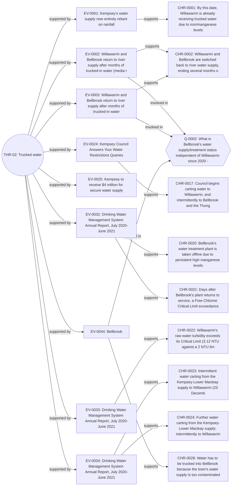
```mermaid
flowchart LR
  DFAPTI_BB_2026_00001_THRD_THR_02(("THR-02: Trucked water"))
  DFAPTI_BB_2026_00001_EVID_EV_0001["EV-0001: Kempsey's water supply now entirely reliant on rainfall"]
  DFAPTI_BB_2026_00001_EVID_EV_0002["EV-0002: Willawarrin and Bellbrook return to river supply after months of trucked-in water (media r"]
  DFAPTI_BB_2026_00001_EVID_EV_0003["EV-0003: Willawarrin and Bellbrook return to river supply after months of trucked-in water"]
  DFAPTI_BB_2026_00001_EVID_EV_0024["EV-0024: Kempsey Council Answers Your Water Restrictions Queries"]
  DFAPTI_BB_2026_00001_EVID_EV_0025["EV-0025: Kempsey to receive $4 million for secure water supply"]
  DFAPTI_BB_2026_00001_EVID_EV_0032["EV-0032: Drinking Water Management System Annual Report, July 2020-June 2021"]
  DFAPTI_BB_2026_00001_EVID_EV_0033["EV-0033: Drinking Water Management System Annual Report, July 2020-June 2021"]
  DFAPTI_BB_2026_00001_EVID_EV_0034["EV-0034: Drinking Water Management System Annual Report, July 2020-June 2021"]
  DFAPTI_BB_2026_00001_EVID_EV_0044["EV-0044: Bellbrook"]
  DFAPTI_BB_2026_00001_CHRO_CHR_0001["CHR-0001: By this date, Willawarrin is already receiving trucked water due to iron/manganese levels "]
  DFAPTI_BB_2026_00001_CHRO_CHR_0002["CHR-0002: Willawarrin and Bellbrook are switched back to river water supply, ending several months o"]
  DFAPTI_BB_2026_00001_QUES_Q_0002{{"Q-0002: What is Bellbrook's water supply/treatment status independent of Willawarrin since 2020 - "}}
  DFAPTI_BB_2026_00001_CHRO_CHR_0017["CHR-0017: Council begins carting water to Willawarrin, and intermittently to Bellbrook and the Thung"]
  DFAPTI_BB_2026_00001_CHRO_CHR_0020["CHR-0020: Bellbrook's water treatment plant is taken offline due to persistent high manganese levels"]
  DFAPTI_BB_2026_00001_CHRO_CHR_0021["CHR-0021: Days after Bellbrook's plant returns to service, a Free Chlorine Critical Limit exceedance"]
  DFAPTI_BB_2026_00001_CHRO_CHR_0022["CHR-0022: Willawarrin's raw-water turbidity exceeds its Critical Limit (3.12 NTU against a 2 NTU lim"]
  DFAPTI_BB_2026_00001_CHRO_CHR_0023["CHR-0023: Intermittent water carting from the Kempsey-Lower Macleay supply to Willawarrin (23 Decemb"]
  DFAPTI_BB_2026_00001_CHRO_CHR_0024["CHR-0024: Further water carting from the Kempsey-Lower Macleay supply: intermittently to Willawarrin"]
  DFAPTI_BB_2026_00001_CHRO_CHR_0028["CHR-0028: Water has to be trucked into Bellbrook because the town's water supply is too contaminated"]
  DFAPTI_BB_2026_00001_THRD_THR_02 -- "supported by" --> DFAPTI_BB_2026_00001_EVID_EV_0001
  DFAPTI_BB_2026_00001_THRD_THR_02 -- "supported by" --> DFAPTI_BB_2026_00001_EVID_EV_0002
  DFAPTI_BB_2026_00001_THRD_THR_02 -- "supported by" --> DFAPTI_BB_2026_00001_EVID_EV_0003
  DFAPTI_BB_2026_00001_THRD_THR_02 -- "supported by" --> DFAPTI_BB_2026_00001_EVID_EV_0024
  DFAPTI_BB_2026_00001_THRD_THR_02 -- "supported by" --> DFAPTI_BB_2026_00001_EVID_EV_0025
  DFAPTI_BB_2026_00001_THRD_THR_02 -- "supported by" --> DFAPTI_BB_2026_00001_EVID_EV_0032
  DFAPTI_BB_2026_00001_THRD_THR_02 -- "supported by" --> DFAPTI_BB_2026_00001_EVID_EV_0033
  DFAPTI_BB_2026_00001_THRD_THR_02 -- "supported by" --> DFAPTI_BB_2026_00001_EVID_EV_0034
  DFAPTI_BB_2026_00001_THRD_THR_02 -- "supported by" --> DFAPTI_BB_2026_00001_EVID_EV_0044
  DFAPTI_BB_2026_00001_EVID_EV_0001 -- "supports" --> DFAPTI_BB_2026_00001_CHRO_CHR_0001
  DFAPTI_BB_2026_00001_EVID_EV_0002 -- "supports" --> DFAPTI_BB_2026_00001_CHRO_CHR_0002
  DFAPTI_BB_2026_00001_EVID_EV_0002 -- "involved in" --> DFAPTI_BB_2026_00001_QUES_Q_0002
  DFAPTI_BB_2026_00001_EVID_EV_0003 -- "supports" --> DFAPTI_BB_2026_00001_CHRO_CHR_0002
  DFAPTI_BB_2026_00001_EVID_EV_0003 -- "involved in" --> DFAPTI_BB_2026_00001_QUES_Q_0002
  DFAPTI_BB_2026_00001_EVID_EV_0024 -- "supports" --> DFAPTI_BB_2026_00001_CHRO_CHR_0017
  DFAPTI_BB_2026_00001_EVID_EV_0032 -- "supports" --> DFAPTI_BB_2026_00001_CHRO_CHR_0020
  DFAPTI_BB_2026_00001_EVID_EV_0032 -- "supports" --> DFAPTI_BB_2026_00001_CHRO_CHR_0021
  DFAPTI_BB_2026_00001_EVID_EV_0033 -- "supports" --> DFAPTI_BB_2026_00001_CHRO_CHR_0022
  DFAPTI_BB_2026_00001_EVID_EV_0034 -- "supports" --> DFAPTI_BB_2026_00001_CHRO_CHR_0023
  DFAPTI_BB_2026_00001_EVID_EV_0034 -- "supports" --> DFAPTI_BB_2026_00001_CHRO_CHR_0024
  DFAPTI_BB_2026_00001_EVID_EV_0044 -- "supports" --> DFAPTI_BB_2026_00001_CHRO_CHR_0028
  DFAPTI_BB_2026_00001_EVID_EV_0044 -- "involved in" --> DFAPTI_BB_2026_00001_QUES_Q_0002
```

#### THR-03 — Iron contamination

Status: In Progress | Completion: Not Complete

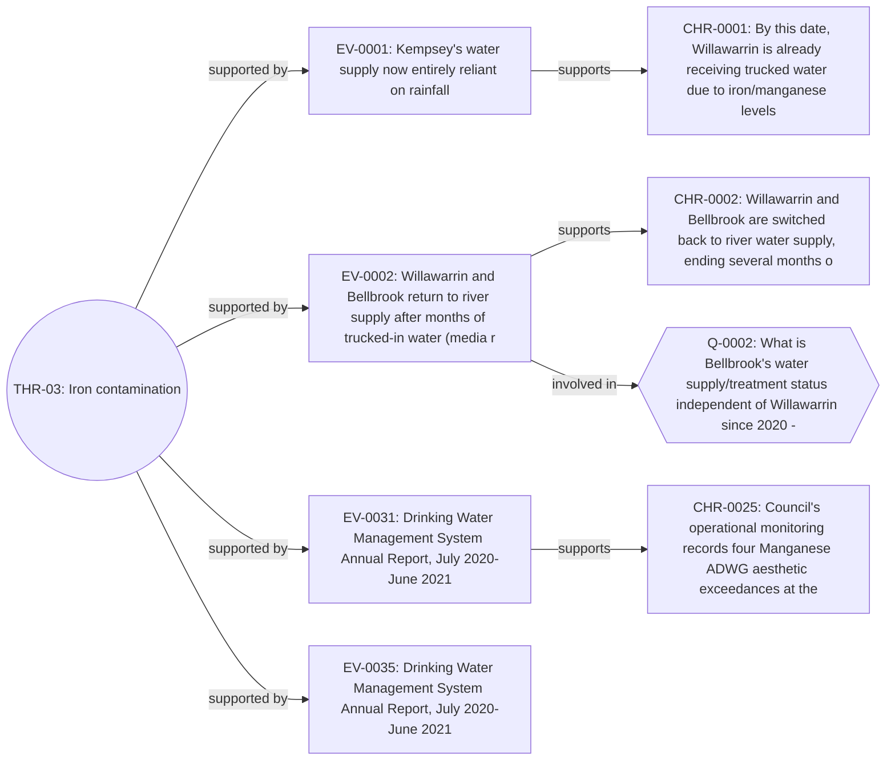
```mermaid
flowchart LR
  DFAPTI_BB_2026_00001_THRD_THR_03(("THR-03: Iron contamination"))
  DFAPTI_BB_2026_00001_EVID_EV_0001["EV-0001: Kempsey's water supply now entirely reliant on rainfall"]
  DFAPTI_BB_2026_00001_EVID_EV_0002["EV-0002: Willawarrin and Bellbrook return to river supply after months of trucked-in water (media r"]
  DFAPTI_BB_2026_00001_EVID_EV_0031["EV-0031: Drinking Water Management System Annual Report, July 2020-June 2021"]
  DFAPTI_BB_2026_00001_EVID_EV_0035["EV-0035: Drinking Water Management System Annual Report, July 2020-June 2021"]
  DFAPTI_BB_2026_00001_CHRO_CHR_0001["CHR-0001: By this date, Willawarrin is already receiving trucked water due to iron/manganese levels "]
  DFAPTI_BB_2026_00001_CHRO_CHR_0002["CHR-0002: Willawarrin and Bellbrook are switched back to river water supply, ending several months o"]
  DFAPTI_BB_2026_00001_QUES_Q_0002{{"Q-0002: What is Bellbrook's water supply/treatment status independent of Willawarrin since 2020 - "}}
  DFAPTI_BB_2026_00001_CHRO_CHR_0025["CHR-0025: Council's operational monitoring records four Manganese ADWG aesthetic exceedances at the "]
  DFAPTI_BB_2026_00001_THRD_THR_03 -- "supported by" --> DFAPTI_BB_2026_00001_EVID_EV_0001
  DFAPTI_BB_2026_00001_THRD_THR_03 -- "supported by" --> DFAPTI_BB_2026_00001_EVID_EV_0002
  DFAPTI_BB_2026_00001_THRD_THR_03 -- "supported by" --> DFAPTI_BB_2026_00001_EVID_EV_0031
  DFAPTI_BB_2026_00001_THRD_THR_03 -- "supported by" --> DFAPTI_BB_2026_00001_EVID_EV_0035
  DFAPTI_BB_2026_00001_EVID_EV_0001 -- "supports" --> DFAPTI_BB_2026_00001_CHRO_CHR_0001
  DFAPTI_BB_2026_00001_EVID_EV_0002 -- "supports" --> DFAPTI_BB_2026_00001_CHRO_CHR_0002
  DFAPTI_BB_2026_00001_EVID_EV_0002 -- "involved in" --> DFAPTI_BB_2026_00001_QUES_Q_0002
  DFAPTI_BB_2026_00001_EVID_EV_0031 -- "supports" --> DFAPTI_BB_2026_00001_CHRO_CHR_0025
```

#### THR-04 — Manganese contamination

Status: In Progress | Completion: Not Complete

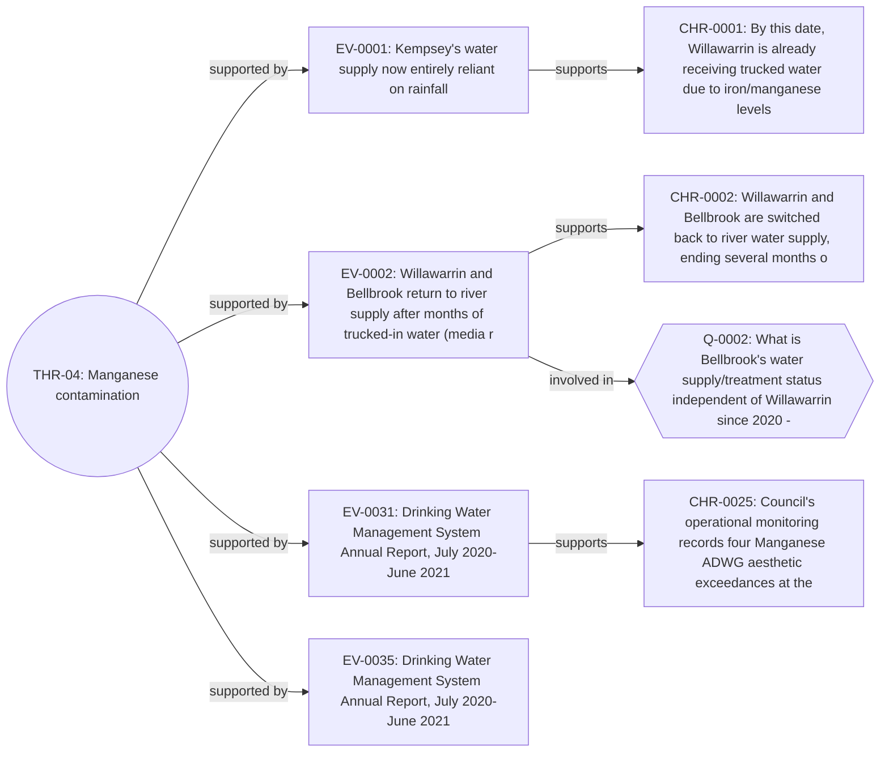
```mermaid
flowchart LR
  DFAPTI_BB_2026_00001_THRD_THR_04(("THR-04: Manganese contamination"))
  DFAPTI_BB_2026_00001_EVID_EV_0001["EV-0001: Kempsey's water supply now entirely reliant on rainfall"]
  DFAPTI_BB_2026_00001_EVID_EV_0002["EV-0002: Willawarrin and Bellbrook return to river supply after months of trucked-in water (media r"]
  DFAPTI_BB_2026_00001_EVID_EV_0031["EV-0031: Drinking Water Management System Annual Report, July 2020-June 2021"]
  DFAPTI_BB_2026_00001_EVID_EV_0035["EV-0035: Drinking Water Management System Annual Report, July 2020-June 2021"]
  DFAPTI_BB_2026_00001_CHRO_CHR_0001["CHR-0001: By this date, Willawarrin is already receiving trucked water due to iron/manganese levels "]
  DFAPTI_BB_2026_00001_CHRO_CHR_0002["CHR-0002: Willawarrin and Bellbrook are switched back to river water supply, ending several months o"]
  DFAPTI_BB_2026_00001_QUES_Q_0002{{"Q-0002: What is Bellbrook's water supply/treatment status independent of Willawarrin since 2020 - "}}
  DFAPTI_BB_2026_00001_CHRO_CHR_0025["CHR-0025: Council's operational monitoring records four Manganese ADWG aesthetic exceedances at the "]
  DFAPTI_BB_2026_00001_THRD_THR_04 -- "supported by" --> DFAPTI_BB_2026_00001_EVID_EV_0001
  DFAPTI_BB_2026_00001_THRD_THR_04 -- "supported by" --> DFAPTI_BB_2026_00001_EVID_EV_0002
  DFAPTI_BB_2026_00001_THRD_THR_04 -- "supported by" --> DFAPTI_BB_2026_00001_EVID_EV_0031
  DFAPTI_BB_2026_00001_THRD_THR_04 -- "supported by" --> DFAPTI_BB_2026_00001_EVID_EV_0035
  DFAPTI_BB_2026_00001_EVID_EV_0001 -- "supports" --> DFAPTI_BB_2026_00001_CHRO_CHR_0001
  DFAPTI_BB_2026_00001_EVID_EV_0002 -- "supports" --> DFAPTI_BB_2026_00001_CHRO_CHR_0002
  DFAPTI_BB_2026_00001_EVID_EV_0002 -- "involved in" --> DFAPTI_BB_2026_00001_QUES_Q_0002
  DFAPTI_BB_2026_00001_EVID_EV_0031 -- "supports" --> DFAPTI_BB_2026_00001_CHRO_CHR_0025
```

#### THR-05 — River conditions

Status: In Progress | Completion: Not Complete

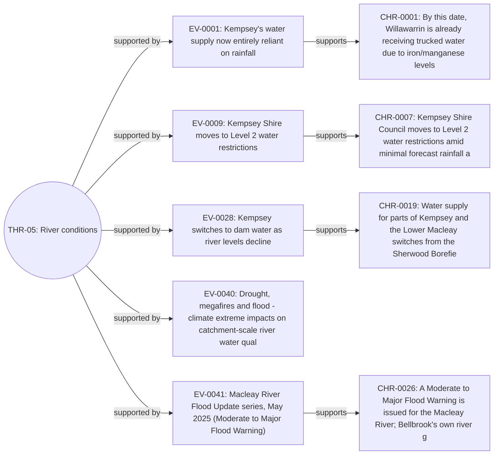
```mermaid
flowchart LR
  DFAPTI_BB_2026_00001_THRD_THR_05(("THR-05: River conditions"))
  DFAPTI_BB_2026_00001_EVID_EV_0001["EV-0001: Kempsey's water supply now entirely reliant on rainfall"]
  DFAPTI_BB_2026_00001_EVID_EV_0009["EV-0009: Kempsey Shire moves to Level 2 water restrictions"]
  DFAPTI_BB_2026_00001_EVID_EV_0028["EV-0028: Kempsey switches to dam water as river levels decline"]
  DFAPTI_BB_2026_00001_EVID_EV_0040["EV-0040: Drought, megafires and flood - climate extreme impacts on catchment-scale river water qual"]
  DFAPTI_BB_2026_00001_EVID_EV_0041["EV-0041: Macleay River Flood Update series, May 2025 (Moderate to Major Flood Warning)"]
  DFAPTI_BB_2026_00001_CHRO_CHR_0001["CHR-0001: By this date, Willawarrin is already receiving trucked water due to iron/manganese levels "]
  DFAPTI_BB_2026_00001_CHRO_CHR_0007["CHR-0007: Kempsey Shire Council moves to Level 2 water restrictions amid minimal forecast rainfall a"]
  DFAPTI_BB_2026_00001_CHRO_CHR_0019["CHR-0019: Water supply for parts of Kempsey and the Lower Macleay switches from the Sherwood Borefie"]
  DFAPTI_BB_2026_00001_CHRO_CHR_0026["CHR-0026: A Moderate to Major Flood Warning is issued for the Macleay River; Bellbrook's own river g"]
  DFAPTI_BB_2026_00001_THRD_THR_05 -- "supported by" --> DFAPTI_BB_2026_00001_EVID_EV_0001
  DFAPTI_BB_2026_00001_THRD_THR_05 -- "supported by" --> DFAPTI_BB_2026_00001_EVID_EV_0009
  DFAPTI_BB_2026_00001_THRD_THR_05 -- "supported by" --> DFAPTI_BB_2026_00001_EVID_EV_0028
  DFAPTI_BB_2026_00001_THRD_THR_05 -- "supported by" --> DFAPTI_BB_2026_00001_EVID_EV_0040
  DFAPTI_BB_2026_00001_THRD_THR_05 -- "supported by" --> DFAPTI_BB_2026_00001_EVID_EV_0041
  DFAPTI_BB_2026_00001_EVID_EV_0001 -- "supports" --> DFAPTI_BB_2026_00001_CHRO_CHR_0001
  DFAPTI_BB_2026_00001_EVID_EV_0009 -- "supports" --> DFAPTI_BB_2026_00001_CHRO_CHR_0007
  DFAPTI_BB_2026_00001_EVID_EV_0028 -- "supports" --> DFAPTI_BB_2026_00001_CHRO_CHR_0019
  DFAPTI_BB_2026_00001_EVID_EV_0041 -- "supports" --> DFAPTI_BB_2026_00001_CHRO_CHR_0026
```

#### THR-06 — Extraction decisions

Status: In Progress | Completion: Not Complete

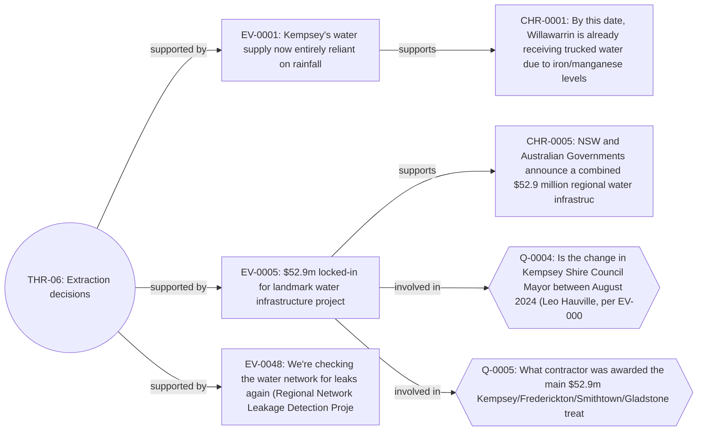
```mermaid
flowchart LR
  DFAPTI_BB_2026_00001_THRD_THR_06(("THR-06: Extraction decisions"))
  DFAPTI_BB_2026_00001_EVID_EV_0001["EV-0001: Kempsey's water supply now entirely reliant on rainfall"]
  DFAPTI_BB_2026_00001_EVID_EV_0005["EV-0005: $52.9m locked-in for landmark water infrastructure project"]
  DFAPTI_BB_2026_00001_EVID_EV_0048["EV-0048: We're checking the water network for leaks again (Regional Network Leakage Detection Proje"]
  DFAPTI_BB_2026_00001_CHRO_CHR_0001["CHR-0001: By this date, Willawarrin is already receiving trucked water due to iron/manganese levels "]
  DFAPTI_BB_2026_00001_CHRO_CHR_0005["CHR-0005: NSW and Australian Governments announce a combined $52.9 million regional water infrastruc"]
  DFAPTI_BB_2026_00001_QUES_Q_0004{{"Q-0004: Is the change in Kempsey Shire Council Mayor between August 2024 (Leo Hauville, per EV-000"}}
  DFAPTI_BB_2026_00001_QUES_Q_0005{{"Q-0005: What contractor was awarded the main $52.9m Kempsey/Frederickton/Smithtown/Gladstone treat"}}
  DFAPTI_BB_2026_00001_THRD_THR_06 -- "supported by" --> DFAPTI_BB_2026_00001_EVID_EV_0001
  DFAPTI_BB_2026_00001_THRD_THR_06 -- "supported by" --> DFAPTI_BB_2026_00001_EVID_EV_0005
  DFAPTI_BB_2026_00001_THRD_THR_06 -- "supported by" --> DFAPTI_BB_2026_00001_EVID_EV_0048
  DFAPTI_BB_2026_00001_EVID_EV_0001 -- "supports" --> DFAPTI_BB_2026_00001_CHRO_CHR_0001
  DFAPTI_BB_2026_00001_EVID_EV_0005 -- "supports" --> DFAPTI_BB_2026_00001_CHRO_CHR_0005
  DFAPTI_BB_2026_00001_EVID_EV_0005 -- "involved in" --> DFAPTI_BB_2026_00001_QUES_Q_0004
  DFAPTI_BB_2026_00001_EVID_EV_0005 -- "involved in" --> DFAPTI_BB_2026_00001_QUES_Q_0005
```

#### THR-07 — Funding

Status: In Progress | Completion: Not Complete

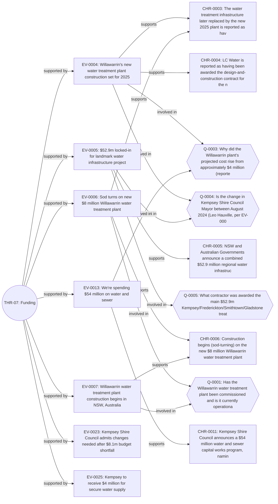
```mermaid
flowchart LR
  DFAPTI_BB_2026_00001_THRD_THR_07(("THR-07: Funding"))
  DFAPTI_BB_2026_00001_EVID_EV_0004["EV-0004: Willawarrin's new water treatment plant construction set for 2025"]
  DFAPTI_BB_2026_00001_EVID_EV_0005["EV-0005: $52.9m locked-in for landmark water infrastructure project"]
  DFAPTI_BB_2026_00001_EVID_EV_0006["EV-0006: Sod turns on new $8 million Willawarrin water treatment plant"]
  DFAPTI_BB_2026_00001_EVID_EV_0007["EV-0007: Willawarrin water treatment plant construction begins in NSW, Australia"]
  DFAPTI_BB_2026_00001_EVID_EV_0013["EV-0013: We're spending $54 million on water and sewer"]
  DFAPTI_BB_2026_00001_EVID_EV_0023["EV-0023: Kempsey Shire Council admits changes needed after $8.1m budget shortfall"]
  DFAPTI_BB_2026_00001_EVID_EV_0025["EV-0025: Kempsey to receive $4 million for secure water supply"]
  DFAPTI_BB_2026_00001_CHRO_CHR_0003["CHR-0003: The water treatment infrastructure later replaced by the new 2025 plant is reported as hav"]
  DFAPTI_BB_2026_00001_CHRO_CHR_0004["CHR-0004: LC Water is reported as having been awarded the design-and-construction contract for the n"]
  DFAPTI_BB_2026_00001_QUES_Q_0003{{"Q-0003: Why did the Willawarrin plant's projected cost rise from approximately $4 million (reporte"}}
  DFAPTI_BB_2026_00001_QUES_Q_0004{{"Q-0004: Is the change in Kempsey Shire Council Mayor between August 2024 (Leo Hauville, per EV-000"}}
  DFAPTI_BB_2026_00001_CHRO_CHR_0005["CHR-0005: NSW and Australian Governments announce a combined $52.9 million regional water infrastruc"]
  DFAPTI_BB_2026_00001_QUES_Q_0005{{"Q-0005: What contractor was awarded the main $52.9m Kempsey/Frederickton/Smithtown/Gladstone treat"}}
  DFAPTI_BB_2026_00001_CHRO_CHR_0006["CHR-0006: Construction begins (sod-turning) on the new $8 million Willawarrin water treatment plant "]
  DFAPTI_BB_2026_00001_QUES_Q_0001{{"Q-0001: Has the Willawarrin water treatment plant been commissioned and is it currently operationa"}}
  DFAPTI_BB_2026_00001_CHRO_CHR_0011["CHR-0011: Kempsey Shire Council announces a $54 million water and sewer capital works program, namin"]
  DFAPTI_BB_2026_00001_THRD_THR_07 -- "supported by" --> DFAPTI_BB_2026_00001_EVID_EV_0004
  DFAPTI_BB_2026_00001_THRD_THR_07 -- "supported by" --> DFAPTI_BB_2026_00001_EVID_EV_0005
  DFAPTI_BB_2026_00001_THRD_THR_07 -- "supported by" --> DFAPTI_BB_2026_00001_EVID_EV_0006
  DFAPTI_BB_2026_00001_THRD_THR_07 -- "supported by" --> DFAPTI_BB_2026_00001_EVID_EV_0007
  DFAPTI_BB_2026_00001_THRD_THR_07 -- "supported by" --> DFAPTI_BB_2026_00001_EVID_EV_0013
  DFAPTI_BB_2026_00001_THRD_THR_07 -- "supported by" --> DFAPTI_BB_2026_00001_EVID_EV_0023
  DFAPTI_BB_2026_00001_THRD_THR_07 -- "supported by" --> DFAPTI_BB_2026_00001_EVID_EV_0025
  DFAPTI_BB_2026_00001_EVID_EV_0004 -- "supports" --> DFAPTI_BB_2026_00001_CHRO_CHR_0003
  DFAPTI_BB_2026_00001_EVID_EV_0004 -- "supports" --> DFAPTI_BB_2026_00001_CHRO_CHR_0004
  DFAPTI_BB_2026_00001_EVID_EV_0004 -- "involved in" --> DFAPTI_BB_2026_00001_QUES_Q_0003
  DFAPTI_BB_2026_00001_EVID_EV_0004 -- "involved in" --> DFAPTI_BB_2026_00001_QUES_Q_0004
  DFAPTI_BB_2026_00001_EVID_EV_0005 -- "supports" --> DFAPTI_BB_2026_00001_CHRO_CHR_0005
  DFAPTI_BB_2026_00001_EVID_EV_0005 -- "involved in" --> DFAPTI_BB_2026_00001_QUES_Q_0004
  DFAPTI_BB_2026_00001_EVID_EV_0005 -- "involved in" --> DFAPTI_BB_2026_00001_QUES_Q_0005
  DFAPTI_BB_2026_00001_EVID_EV_0006 -- "supports" --> DFAPTI_BB_2026_00001_CHRO_CHR_0003
  DFAPTI_BB_2026_00001_EVID_EV_0006 -- "supports" --> DFAPTI_BB_2026_00001_CHRO_CHR_0006
  DFAPTI_BB_2026_00001_EVID_EV_0006 -- "involved in" --> DFAPTI_BB_2026_00001_QUES_Q_0001
  DFAPTI_BB_2026_00001_EVID_EV_0007 -- "supports" --> DFAPTI_BB_2026_00001_CHRO_CHR_0006
  DFAPTI_BB_2026_00001_EVID_EV_0007 -- "involved in" --> DFAPTI_BB_2026_00001_QUES_Q_0001
  DFAPTI_BB_2026_00001_EVID_EV_0013 -- "supports" --> DFAPTI_BB_2026_00001_CHRO_CHR_0011
  DFAPTI_BB_2026_00001_EVID_EV_0013 -- "involved in" --> DFAPTI_BB_2026_00001_QUES_Q_0003
```

#### THR-08 — Treatment plant

Status: In Progress | Completion: Not Complete

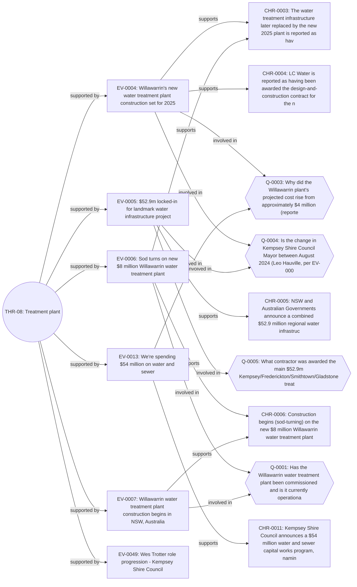
```mermaid
flowchart LR
  DFAPTI_BB_2026_00001_THRD_THR_08(("THR-08: Treatment plant"))
  DFAPTI_BB_2026_00001_EVID_EV_0004["EV-0004: Willawarrin's new water treatment plant construction set for 2025"]
  DFAPTI_BB_2026_00001_EVID_EV_0005["EV-0005: $52.9m locked-in for landmark water infrastructure project"]
  DFAPTI_BB_2026_00001_EVID_EV_0006["EV-0006: Sod turns on new $8 million Willawarrin water treatment plant"]
  DFAPTI_BB_2026_00001_EVID_EV_0007["EV-0007: Willawarrin water treatment plant construction begins in NSW, Australia"]
  DFAPTI_BB_2026_00001_EVID_EV_0013["EV-0013: We're spending $54 million on water and sewer"]
  DFAPTI_BB_2026_00001_EVID_EV_0049["EV-0049: Wes Trotter role progression - Kempsey Shire Council"]
  DFAPTI_BB_2026_00001_CHRO_CHR_0003["CHR-0003: The water treatment infrastructure later replaced by the new 2025 plant is reported as hav"]
  DFAPTI_BB_2026_00001_CHRO_CHR_0004["CHR-0004: LC Water is reported as having been awarded the design-and-construction contract for the n"]
  DFAPTI_BB_2026_00001_QUES_Q_0003{{"Q-0003: Why did the Willawarrin plant's projected cost rise from approximately $4 million (reporte"}}
  DFAPTI_BB_2026_00001_QUES_Q_0004{{"Q-0004: Is the change in Kempsey Shire Council Mayor between August 2024 (Leo Hauville, per EV-000"}}
  DFAPTI_BB_2026_00001_CHRO_CHR_0005["CHR-0005: NSW and Australian Governments announce a combined $52.9 million regional water infrastruc"]
  DFAPTI_BB_2026_00001_QUES_Q_0005{{"Q-0005: What contractor was awarded the main $52.9m Kempsey/Frederickton/Smithtown/Gladstone treat"}}
  DFAPTI_BB_2026_00001_CHRO_CHR_0006["CHR-0006: Construction begins (sod-turning) on the new $8 million Willawarrin water treatment plant "]
  DFAPTI_BB_2026_00001_QUES_Q_0001{{"Q-0001: Has the Willawarrin water treatment plant been commissioned and is it currently operationa"}}
  DFAPTI_BB_2026_00001_CHRO_CHR_0011["CHR-0011: Kempsey Shire Council announces a $54 million water and sewer capital works program, namin"]
  DFAPTI_BB_2026_00001_THRD_THR_08 -- "supported by" --> DFAPTI_BB_2026_00001_EVID_EV_0004
  DFAPTI_BB_2026_00001_THRD_THR_08 -- "supported by" --> DFAPTI_BB_2026_00001_EVID_EV_0005
  DFAPTI_BB_2026_00001_THRD_THR_08 -- "supported by" --> DFAPTI_BB_2026_00001_EVID_EV_0006
  DFAPTI_BB_2026_00001_THRD_THR_08 -- "supported by" --> DFAPTI_BB_2026_00001_EVID_EV_0007
  DFAPTI_BB_2026_00001_THRD_THR_08 -- "supported by" --> DFAPTI_BB_2026_00001_EVID_EV_0013
  DFAPTI_BB_2026_00001_THRD_THR_08 -- "supported by" --> DFAPTI_BB_2026_00001_EVID_EV_0049
  DFAPTI_BB_2026_00001_EVID_EV_0004 -- "supports" --> DFAPTI_BB_2026_00001_CHRO_CHR_0003
  DFAPTI_BB_2026_00001_EVID_EV_0004 -- "supports" --> DFAPTI_BB_2026_00001_CHRO_CHR_0004
  DFAPTI_BB_2026_00001_EVID_EV_0004 -- "involved in" --> DFAPTI_BB_2026_00001_QUES_Q_0003
  DFAPTI_BB_2026_00001_EVID_EV_0004 -- "involved in" --> DFAPTI_BB_2026_00001_QUES_Q_0004
  DFAPTI_BB_2026_00001_EVID_EV_0005 -- "supports" --> DFAPTI_BB_2026_00001_CHRO_CHR_0005
  DFAPTI_BB_2026_00001_EVID_EV_0005 -- "involved in" --> DFAPTI_BB_2026_00001_QUES_Q_0004
  DFAPTI_BB_2026_00001_EVID_EV_0005 -- "involved in" --> DFAPTI_BB_2026_00001_QUES_Q_0005
  DFAPTI_BB_2026_00001_EVID_EV_0006 -- "supports" --> DFAPTI_BB_2026_00001_CHRO_CHR_0003
  DFAPTI_BB_2026_00001_EVID_EV_0006 -- "supports" --> DFAPTI_BB_2026_00001_CHRO_CHR_0006
  DFAPTI_BB_2026_00001_EVID_EV_0006 -- "involved in" --> DFAPTI_BB_2026_00001_QUES_Q_0001
  DFAPTI_BB_2026_00001_EVID_EV_0007 -- "supports" --> DFAPTI_BB_2026_00001_CHRO_CHR_0006
  DFAPTI_BB_2026_00001_EVID_EV_0007 -- "involved in" --> DFAPTI_BB_2026_00001_QUES_Q_0001
  DFAPTI_BB_2026_00001_EVID_EV_0013 -- "supports" --> DFAPTI_BB_2026_00001_CHRO_CHR_0011
  DFAPTI_BB_2026_00001_EVID_EV_0013 -- "involved in" --> DFAPTI_BB_2026_00001_QUES_Q_0003
```

#### THR-09 — Construction

Status: In Progress | Completion: Not Complete

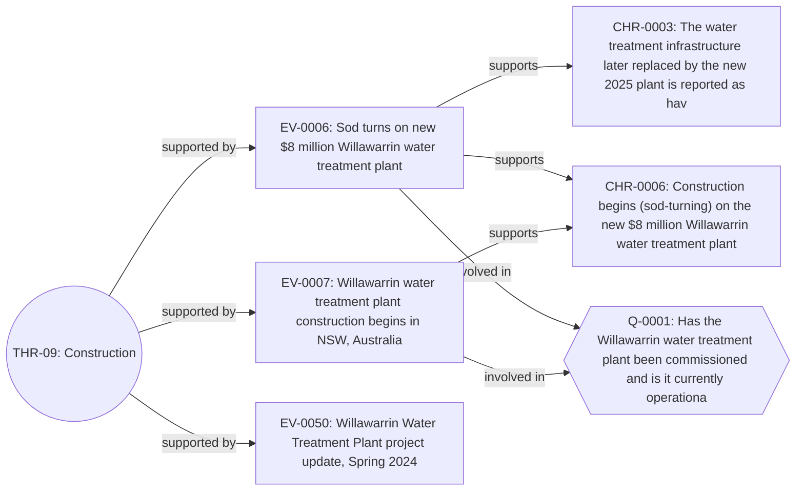
```mermaid
flowchart LR
  DFAPTI_BB_2026_00001_THRD_THR_09(("THR-09: Construction"))
  DFAPTI_BB_2026_00001_EVID_EV_0006["EV-0006: Sod turns on new $8 million Willawarrin water treatment plant"]
  DFAPTI_BB_2026_00001_EVID_EV_0007["EV-0007: Willawarrin water treatment plant construction begins in NSW, Australia"]
  DFAPTI_BB_2026_00001_EVID_EV_0050["EV-0050: Willawarrin Water Treatment Plant project update, Spring 2024"]
  DFAPTI_BB_2026_00001_CHRO_CHR_0003["CHR-0003: The water treatment infrastructure later replaced by the new 2025 plant is reported as hav"]
  DFAPTI_BB_2026_00001_CHRO_CHR_0006["CHR-0006: Construction begins (sod-turning) on the new $8 million Willawarrin water treatment plant "]
  DFAPTI_BB_2026_00001_QUES_Q_0001{{"Q-0001: Has the Willawarrin water treatment plant been commissioned and is it currently operationa"}}
  DFAPTI_BB_2026_00001_THRD_THR_09 -- "supported by" --> DFAPTI_BB_2026_00001_EVID_EV_0006
  DFAPTI_BB_2026_00001_THRD_THR_09 -- "supported by" --> DFAPTI_BB_2026_00001_EVID_EV_0007
  DFAPTI_BB_2026_00001_THRD_THR_09 -- "supported by" --> DFAPTI_BB_2026_00001_EVID_EV_0050
  DFAPTI_BB_2026_00001_EVID_EV_0006 -- "supports" --> DFAPTI_BB_2026_00001_CHRO_CHR_0003
  DFAPTI_BB_2026_00001_EVID_EV_0006 -- "supports" --> DFAPTI_BB_2026_00001_CHRO_CHR_0006
  DFAPTI_BB_2026_00001_EVID_EV_0006 -- "involved in" --> DFAPTI_BB_2026_00001_QUES_Q_0001
  DFAPTI_BB_2026_00001_EVID_EV_0007 -- "supports" --> DFAPTI_BB_2026_00001_CHRO_CHR_0006
  DFAPTI_BB_2026_00001_EVID_EV_0007 -- "involved in" --> DFAPTI_BB_2026_00001_QUES_Q_0001
```

#### THR-10 — Commissioning

Status: In Progress | Completion: Not Complete

_No linked evidence recorded yet for this thread._

#### THR-11 — Completion

Status: Not Started | Completion: Not Complete

_No linked evidence recorded yet for this thread._

#### THR-12 — Current operational status

Status: In Progress | Completion: Not Complete

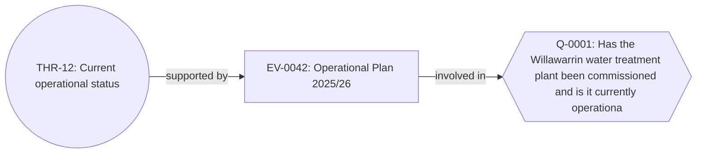
```mermaid
flowchart LR
  DFAPTI_BB_2026_00001_THRD_THR_12(("THR-12: Current operational status"))
  DFAPTI_BB_2026_00001_EVID_EV_0042["EV-0042: Operational Plan 2025/26"]
  DFAPTI_BB_2026_00001_QUES_Q_0001{{"Q-0001: Has the Willawarrin water treatment plant been commissioned and is it currently operationa"}}
  DFAPTI_BB_2026_00001_THRD_THR_12 -- "supported by" --> DFAPTI_BB_2026_00001_EVID_EV_0042
  DFAPTI_BB_2026_00001_EVID_EV_0042 -- "involved in" --> DFAPTI_BB_2026_00001_QUES_Q_0001
```

#### THR-13 — Regional water security funding program (Steuart McIntyre Dam / Sherwood Borefield)

Status: In Progress | Completion: Not Complete

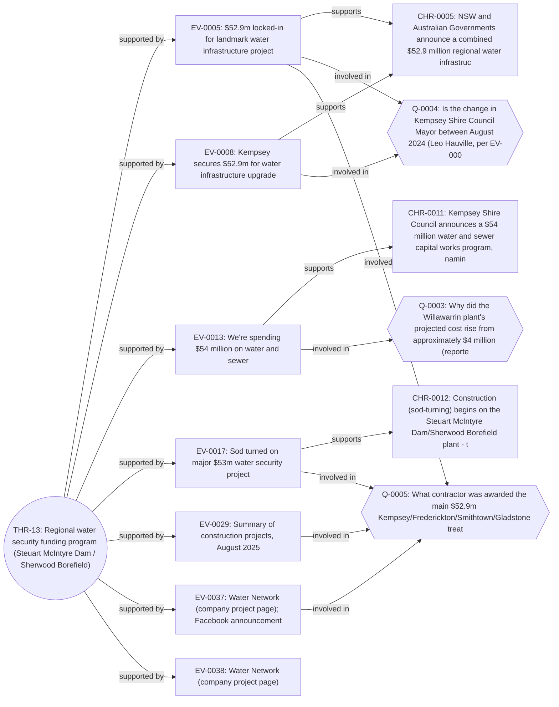
```mermaid
flowchart LR
  DFAPTI_BB_2026_00001_THRD_THR_13(("THR-13: Regional water security funding program (Steuart McIntyre Dam / Sherwood Borefield)"))
  DFAPTI_BB_2026_00001_EVID_EV_0005["EV-0005: $52.9m locked-in for landmark water infrastructure project"]
  DFAPTI_BB_2026_00001_EVID_EV_0008["EV-0008: Kempsey secures $52.9m for water infrastructure upgrade"]
  DFAPTI_BB_2026_00001_EVID_EV_0013["EV-0013: We're spending $54 million on water and sewer"]
  DFAPTI_BB_2026_00001_EVID_EV_0017["EV-0017: Sod turned on major $53m water security project"]
  DFAPTI_BB_2026_00001_EVID_EV_0029["EV-0029: Summary of construction projects, August 2025"]
  DFAPTI_BB_2026_00001_EVID_EV_0037["EV-0037: Water Network (company project page); Facebook announcement"]
  DFAPTI_BB_2026_00001_EVID_EV_0038["EV-0038: Water Network (company project page)"]
  DFAPTI_BB_2026_00001_CHRO_CHR_0005["CHR-0005: NSW and Australian Governments announce a combined $52.9 million regional water infrastruc"]
  DFAPTI_BB_2026_00001_QUES_Q_0004{{"Q-0004: Is the change in Kempsey Shire Council Mayor between August 2024 (Leo Hauville, per EV-000"}}
  DFAPTI_BB_2026_00001_QUES_Q_0005{{"Q-0005: What contractor was awarded the main $52.9m Kempsey/Frederickton/Smithtown/Gladstone treat"}}
  DFAPTI_BB_2026_00001_CHRO_CHR_0011["CHR-0011: Kempsey Shire Council announces a $54 million water and sewer capital works program, namin"]
  DFAPTI_BB_2026_00001_QUES_Q_0003{{"Q-0003: Why did the Willawarrin plant's projected cost rise from approximately $4 million (reporte"}}
  DFAPTI_BB_2026_00001_CHRO_CHR_0012["CHR-0012: Construction (sod-turning) begins on the Steuart McIntyre Dam/Sherwood Borefield plant - t"]
  DFAPTI_BB_2026_00001_THRD_THR_13 -- "supported by" --> DFAPTI_BB_2026_00001_EVID_EV_0005
  DFAPTI_BB_2026_00001_THRD_THR_13 -- "supported by" --> DFAPTI_BB_2026_00001_EVID_EV_0008
  DFAPTI_BB_2026_00001_THRD_THR_13 -- "supported by" --> DFAPTI_BB_2026_00001_EVID_EV_0013
  DFAPTI_BB_2026_00001_THRD_THR_13 -- "supported by" --> DFAPTI_BB_2026_00001_EVID_EV_0017
  DFAPTI_BB_2026_00001_THRD_THR_13 -- "supported by" --> DFAPTI_BB_2026_00001_EVID_EV_0029
  DFAPTI_BB_2026_00001_THRD_THR_13 -- "supported by" --> DFAPTI_BB_2026_00001_EVID_EV_0037
  DFAPTI_BB_2026_00001_THRD_THR_13 -- "supported by" --> DFAPTI_BB_2026_00001_EVID_EV_0038
  DFAPTI_BB_2026_00001_EVID_EV_0005 -- "supports" --> DFAPTI_BB_2026_00001_CHRO_CHR_0005
  DFAPTI_BB_2026_00001_EVID_EV_0005 -- "involved in" --> DFAPTI_BB_2026_00001_QUES_Q_0004
  DFAPTI_BB_2026_00001_EVID_EV_0005 -- "involved in" --> DFAPTI_BB_2026_00001_QUES_Q_0005
  DFAPTI_BB_2026_00001_EVID_EV_0008 -- "supports" --> DFAPTI_BB_2026_00001_CHRO_CHR_0005
  DFAPTI_BB_2026_00001_EVID_EV_0008 -- "involved in" --> DFAPTI_BB_2026_00001_QUES_Q_0004
  DFAPTI_BB_2026_00001_EVID_EV_0013 -- "supports" --> DFAPTI_BB_2026_00001_CHRO_CHR_0011
  DFAPTI_BB_2026_00001_EVID_EV_0013 -- "involved in" --> DFAPTI_BB_2026_00001_QUES_Q_0003
  DFAPTI_BB_2026_00001_EVID_EV_0017 -- "supports" --> DFAPTI_BB_2026_00001_CHRO_CHR_0012
  DFAPTI_BB_2026_00001_EVID_EV_0017 -- "involved in" --> DFAPTI_BB_2026_00001_QUES_Q_0005
  DFAPTI_BB_2026_00001_EVID_EV_0029 -- "involved in" --> DFAPTI_BB_2026_00001_QUES_Q_0005
  DFAPTI_BB_2026_00001_EVID_EV_0037 -- "involved in" --> DFAPTI_BB_2026_00001_QUES_Q_0005
```

#### THR-14 — Bellbrook-specific infrastructure status

Status: In Progress | Completion: Not Complete

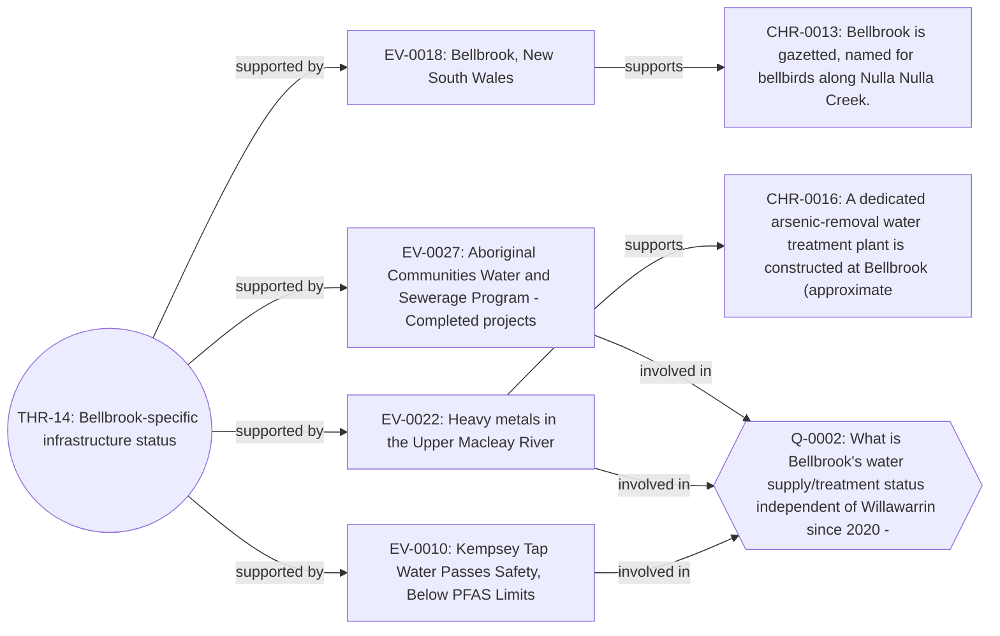
```mermaid
flowchart LR
  DFAPTI_BB_2026_00001_THRD_THR_14(("THR-14: Bellbrook-specific infrastructure status"))
  DFAPTI_BB_2026_00001_EVID_EV_0010["EV-0010: Kempsey Tap Water Passes Safety, Below PFAS Limits"]
  DFAPTI_BB_2026_00001_EVID_EV_0018["EV-0018: Bellbrook, New South Wales"]
  DFAPTI_BB_2026_00001_EVID_EV_0022["EV-0022: Heavy metals in the Upper Macleay River"]
  DFAPTI_BB_2026_00001_EVID_EV_0027["EV-0027: Aboriginal Communities Water and Sewerage Program - Completed projects"]
  DFAPTI_BB_2026_00001_QUES_Q_0002{{"Q-0002: What is Bellbrook's water supply/treatment status independent of Willawarrin since 2020 - "}}
  DFAPTI_BB_2026_00001_CHRO_CHR_0013["CHR-0013: Bellbrook is gazetted, named for bellbirds along Nulla Nulla Creek."]
  DFAPTI_BB_2026_00001_CHRO_CHR_0016["CHR-0016: A dedicated arsenic-removal water treatment plant is constructed at Bellbrook (approximate"]
  DFAPTI_BB_2026_00001_THRD_THR_14 -- "supported by" --> DFAPTI_BB_2026_00001_EVID_EV_0010
  DFAPTI_BB_2026_00001_THRD_THR_14 -- "supported by" --> DFAPTI_BB_2026_00001_EVID_EV_0018
  DFAPTI_BB_2026_00001_THRD_THR_14 -- "supported by" --> DFAPTI_BB_2026_00001_EVID_EV_0022
  DFAPTI_BB_2026_00001_THRD_THR_14 -- "supported by" --> DFAPTI_BB_2026_00001_EVID_EV_0027
  DFAPTI_BB_2026_00001_EVID_EV_0010 -- "involved in" --> DFAPTI_BB_2026_00001_QUES_Q_0002
  DFAPTI_BB_2026_00001_EVID_EV_0018 -- "supports" --> DFAPTI_BB_2026_00001_CHRO_CHR_0013
  DFAPTI_BB_2026_00001_EVID_EV_0022 -- "supports" --> DFAPTI_BB_2026_00001_CHRO_CHR_0016
  DFAPTI_BB_2026_00001_EVID_EV_0022 -- "involved in" --> DFAPTI_BB_2026_00001_QUES_Q_0002
  DFAPTI_BB_2026_00001_EVID_EV_0027 -- "involved in" --> DFAPTI_BB_2026_00001_QUES_Q_0002
```

#### THR-15 — Kempsey Shire Council leadership timeline (evidence-attribution context)

Status: Complete | Completion: Complete

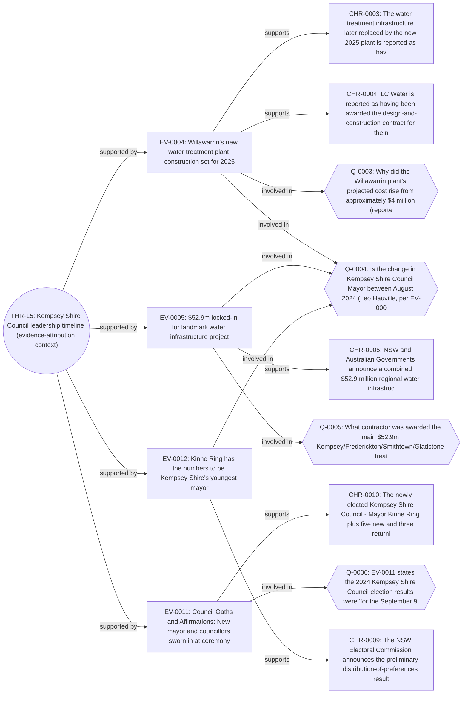
```mermaid
flowchart LR
  DFAPTI_BB_2026_00001_THRD_THR_15(("THR-15: Kempsey Shire Council leadership timeline (evidence-attribution context)"))
  DFAPTI_BB_2026_00001_EVID_EV_0004["EV-0004: Willawarrin's new water treatment plant construction set for 2025"]
  DFAPTI_BB_2026_00001_EVID_EV_0005["EV-0005: $52.9m locked-in for landmark water infrastructure project"]
  DFAPTI_BB_2026_00001_EVID_EV_0011["EV-0011: Council Oaths and Affirmations: New mayor and councillors sworn in at ceremony"]
  DFAPTI_BB_2026_00001_EVID_EV_0012["EV-0012: Kinne Ring has the numbers to be Kempsey Shire's youngest mayor"]
  DFAPTI_BB_2026_00001_CHRO_CHR_0003["CHR-0003: The water treatment infrastructure later replaced by the new 2025 plant is reported as hav"]
  DFAPTI_BB_2026_00001_CHRO_CHR_0004["CHR-0004: LC Water is reported as having been awarded the design-and-construction contract for the n"]
  DFAPTI_BB_2026_00001_QUES_Q_0003{{"Q-0003: Why did the Willawarrin plant's projected cost rise from approximately $4 million (reporte"}}
  DFAPTI_BB_2026_00001_QUES_Q_0004{{"Q-0004: Is the change in Kempsey Shire Council Mayor between August 2024 (Leo Hauville, per EV-000"}}
  DFAPTI_BB_2026_00001_CHRO_CHR_0005["CHR-0005: NSW and Australian Governments announce a combined $52.9 million regional water infrastruc"]
  DFAPTI_BB_2026_00001_QUES_Q_0005{{"Q-0005: What contractor was awarded the main $52.9m Kempsey/Frederickton/Smithtown/Gladstone treat"}}
  DFAPTI_BB_2026_00001_CHRO_CHR_0010["CHR-0010: The newly elected Kempsey Shire Council - Mayor Kinne Ring plus five new and three returni"]
  DFAPTI_BB_2026_00001_QUES_Q_0006{{"Q-0006: EV-0011 states the 2024 Kempsey Shire Council election results were 'for the September 9, "}}
  DFAPTI_BB_2026_00001_CHRO_CHR_0009["CHR-0009: The NSW Electoral Commission announces the preliminary distribution-of-preferences result "]
  DFAPTI_BB_2026_00001_THRD_THR_15 -- "supported by" --> DFAPTI_BB_2026_00001_EVID_EV_0004
  DFAPTI_BB_2026_00001_THRD_THR_15 -- "supported by" --> DFAPTI_BB_2026_00001_EVID_EV_0005
  DFAPTI_BB_2026_00001_THRD_THR_15 -- "supported by" --> DFAPTI_BB_2026_00001_EVID_EV_0011
  DFAPTI_BB_2026_00001_THRD_THR_15 -- "supported by" --> DFAPTI_BB_2026_00001_EVID_EV_0012
  DFAPTI_BB_2026_00001_EVID_EV_0004 -- "supports" --> DFAPTI_BB_2026_00001_CHRO_CHR_0003
  DFAPTI_BB_2026_00001_EVID_EV_0004 -- "supports" --> DFAPTI_BB_2026_00001_CHRO_CHR_0004
  DFAPTI_BB_2026_00001_EVID_EV_0004 -- "involved in" --> DFAPTI_BB_2026_00001_QUES_Q_0003
  DFAPTI_BB_2026_00001_EVID_EV_0004 -- "involved in" --> DFAPTI_BB_2026_00001_QUES_Q_0004
  DFAPTI_BB_2026_00001_EVID_EV_0005 -- "supports" --> DFAPTI_BB_2026_00001_CHRO_CHR_0005
  DFAPTI_BB_2026_00001_EVID_EV_0005 -- "involved in" --> DFAPTI_BB_2026_00001_QUES_Q_0004
  DFAPTI_BB_2026_00001_EVID_EV_0005 -- "involved in" --> DFAPTI_BB_2026_00001_QUES_Q_0005
  DFAPTI_BB_2026_00001_EVID_EV_0011 -- "supports" --> DFAPTI_BB_2026_00001_CHRO_CHR_0010
  DFAPTI_BB_2026_00001_EVID_EV_0011 -- "involved in" --> DFAPTI_BB_2026_00001_QUES_Q_0006
  DFAPTI_BB_2026_00001_EVID_EV_0012 -- "supports" --> DFAPTI_BB_2026_00001_CHRO_CHR_0009
  DFAPTI_BB_2026_00001_EVID_EV_0012 -- "involved in" --> DFAPTI_BB_2026_00001_QUES_Q_0004
```

## Case: DFAPTI-MNC-2026-00001

224 relationship reference(s) across 840 evidence, 21 chronology, 2 contradiction, 18 open question, 12 thread record(s).

### Thread dependencies

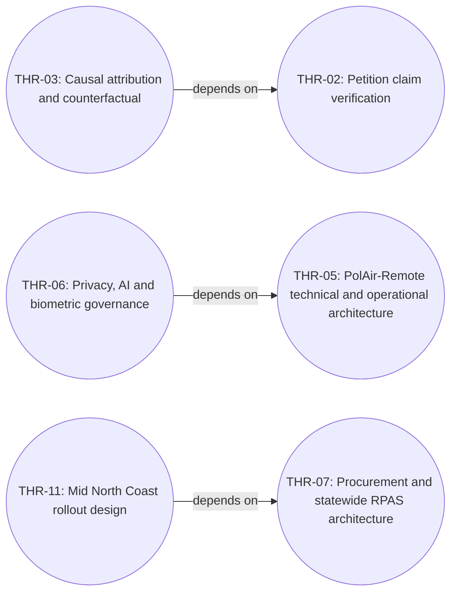
```mermaid
flowchart LR
  DFAPTI_MNC_2026_00001_THRD_THR_03(("THR-03: Causal attribution and counterfactual"))
  DFAPTI_MNC_2026_00001_THRD_THR_02(("THR-02: Petition claim verification"))
  DFAPTI_MNC_2026_00001_THRD_THR_06(("THR-06: Privacy, AI and biometric governance"))
  DFAPTI_MNC_2026_00001_THRD_THR_05(("THR-05: PolAir-Remote technical and operational architecture"))
  DFAPTI_MNC_2026_00001_THRD_THR_11(("THR-11: Mid North Coast rollout design"))
  DFAPTI_MNC_2026_00001_THRD_THR_07(("THR-07: Procurement and statewide RPAS architecture"))
  DFAPTI_MNC_2026_00001_THRD_THR_03 -- "depends on" --> DFAPTI_MNC_2026_00001_THRD_THR_02
  DFAPTI_MNC_2026_00001_THRD_THR_06 -- "depends on" --> DFAPTI_MNC_2026_00001_THRD_THR_05
  DFAPTI_MNC_2026_00001_THRD_THR_11 -- "depends on" --> DFAPTI_MNC_2026_00001_THRD_THR_07
```

### Threads

#### THR-01 — Trial evaluation and evidence base

Status: In Progress | Completion: Not Complete

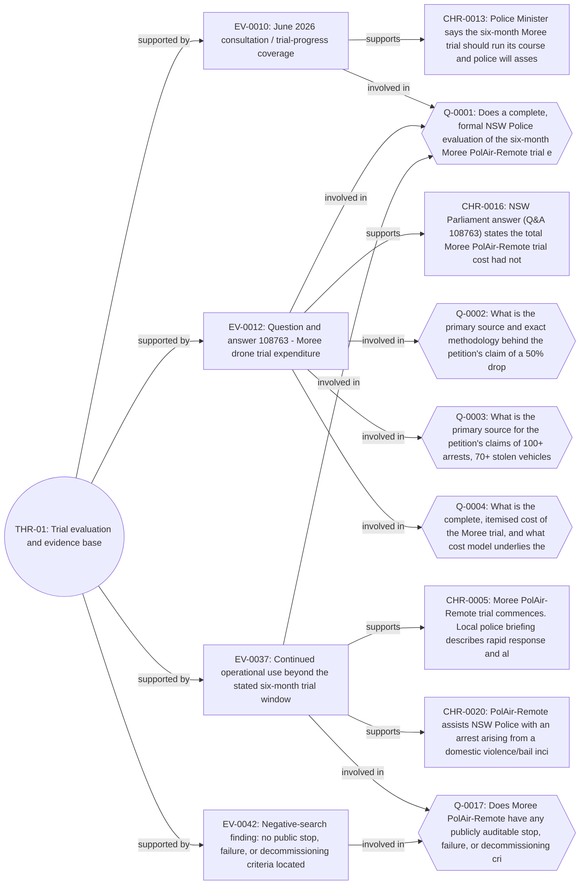
```mermaid
flowchart LR
  DFAPTI_MNC_2026_00001_THRD_THR_01(("THR-01: Trial evaluation and evidence base"))
  DFAPTI_MNC_2026_00001_EVID_EV_0010["EV-0010: June 2026 consultation / trial-progress coverage"]
  DFAPTI_MNC_2026_00001_EVID_EV_0012["EV-0012: Question and answer 108763 - Moree drone trial expenditure"]
  DFAPTI_MNC_2026_00001_EVID_EV_0037["EV-0037: Continued operational use beyond the stated six-month trial window"]
  DFAPTI_MNC_2026_00001_EVID_EV_0042["EV-0042: Negative-search finding: no public stop, failure, or decommissioning criteria located"]
  DFAPTI_MNC_2026_00001_CHRO_CHR_0013["CHR-0013: Police Minister says the six-month Moree trial should run its course and police will asses"]
  DFAPTI_MNC_2026_00001_QUES_Q_0001{{"Q-0001: Does a complete, formal NSW Police evaluation of the six-month Moree PolAir-Remote trial e"}}
  DFAPTI_MNC_2026_00001_CHRO_CHR_0016["CHR-0016: NSW Parliament answer (Q&A 108763) states the total Moree PolAir-Remote trial cost had not"]
  DFAPTI_MNC_2026_00001_QUES_Q_0002{{"Q-0002: What is the primary source and exact methodology behind the petition's claim of a 50% drop"}}
  DFAPTI_MNC_2026_00001_QUES_Q_0003{{"Q-0003: What is the primary source for the petition's claims of 100+ arrests, 70+ stolen vehicles "}}
  DFAPTI_MNC_2026_00001_QUES_Q_0004{{"Q-0004: What is the complete, itemised cost of the Moree trial, and what cost model underlies the "}}
  DFAPTI_MNC_2026_00001_CHRO_CHR_0005["CHR-0005: Moree PolAir-Remote trial commences. Local police briefing describes rapid response and al"]
  DFAPTI_MNC_2026_00001_CHRO_CHR_0020["CHR-0020: PolAir-Remote assists NSW Police with an arrest arising from a domestic violence/bail inci"]
  DFAPTI_MNC_2026_00001_QUES_Q_0017{{"Q-0017: Does Moree PolAir-Remote have any publicly auditable stop, failure, or decommissioning cri"}}
  DFAPTI_MNC_2026_00001_THRD_THR_01 -- "supported by" --> DFAPTI_MNC_2026_00001_EVID_EV_0010
  DFAPTI_MNC_2026_00001_THRD_THR_01 -- "supported by" --> DFAPTI_MNC_2026_00001_EVID_EV_0012
  DFAPTI_MNC_2026_00001_THRD_THR_01 -- "supported by" --> DFAPTI_MNC_2026_00001_EVID_EV_0037
  DFAPTI_MNC_2026_00001_THRD_THR_01 -- "supported by" --> DFAPTI_MNC_2026_00001_EVID_EV_0042
  DFAPTI_MNC_2026_00001_EVID_EV_0010 -- "supports" --> DFAPTI_MNC_2026_00001_CHRO_CHR_0013
  DFAPTI_MNC_2026_00001_EVID_EV_0010 -- "involved in" --> DFAPTI_MNC_2026_00001_QUES_Q_0001
  DFAPTI_MNC_2026_00001_EVID_EV_0012 -- "supports" --> DFAPTI_MNC_2026_00001_CHRO_CHR_0016
  DFAPTI_MNC_2026_00001_EVID_EV_0012 -- "involved in" --> DFAPTI_MNC_2026_00001_QUES_Q_0001
  DFAPTI_MNC_2026_00001_EVID_EV_0012 -- "involved in" --> DFAPTI_MNC_2026_00001_QUES_Q_0002
  DFAPTI_MNC_2026_00001_EVID_EV_0012 -- "involved in" --> DFAPTI_MNC_2026_00001_QUES_Q_0003
  DFAPTI_MNC_2026_00001_EVID_EV_0012 -- "involved in" --> DFAPTI_MNC_2026_00001_QUES_Q_0004
  DFAPTI_MNC_2026_00001_EVID_EV_0037 -- "supports" --> DFAPTI_MNC_2026_00001_CHRO_CHR_0005
  DFAPTI_MNC_2026_00001_EVID_EV_0037 -- "supports" --> DFAPTI_MNC_2026_00001_CHRO_CHR_0020
  DFAPTI_MNC_2026_00001_EVID_EV_0037 -- "involved in" --> DFAPTI_MNC_2026_00001_QUES_Q_0001
  DFAPTI_MNC_2026_00001_EVID_EV_0037 -- "involved in" --> DFAPTI_MNC_2026_00001_QUES_Q_0017
  DFAPTI_MNC_2026_00001_EVID_EV_0042 -- "involved in" --> DFAPTI_MNC_2026_00001_QUES_Q_0017
```

#### THR-02 — Petition claim verification

Status: In Progress | Completion: Not Complete

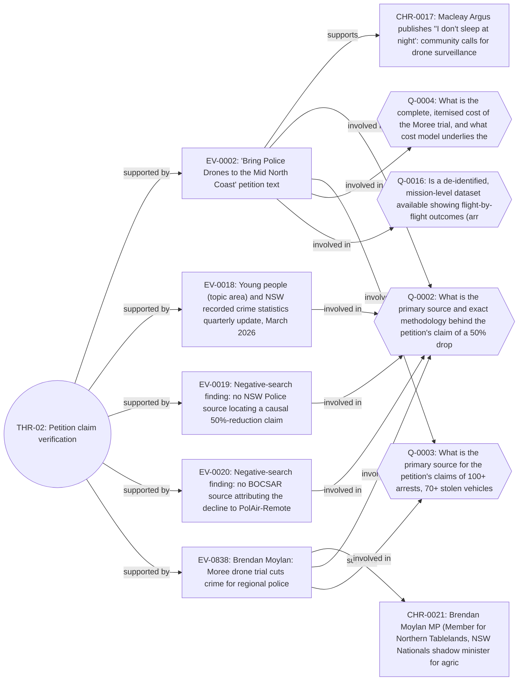
```mermaid
flowchart LR
  DFAPTI_MNC_2026_00001_THRD_THR_02(("THR-02: Petition claim verification"))
  DFAPTI_MNC_2026_00001_EVID_EV_0002["EV-0002: 'Bring Police Drones to the Mid North Coast' petition text"]
  DFAPTI_MNC_2026_00001_EVID_EV_0018["EV-0018: Young people (topic area) and NSW recorded crime statistics quarterly update, March 2026"]
  DFAPTI_MNC_2026_00001_EVID_EV_0019["EV-0019: Negative-search finding: no NSW Police source locating a causal 50%-reduction claim"]
  DFAPTI_MNC_2026_00001_EVID_EV_0020["EV-0020: Negative-search finding: no BOCSAR source attributing the decline to PolAir-Remote"]
  DFAPTI_MNC_2026_00001_EVID_EV_0838["EV-0838: Brendan Moylan: Moree drone trial cuts crime for regional police"]
  DFAPTI_MNC_2026_00001_CHRO_CHR_0017["CHR-0017: Macleay Argus publishes ''I don't sleep at night': community calls for drone surveillance "]
  DFAPTI_MNC_2026_00001_QUES_Q_0002{{"Q-0002: What is the primary source and exact methodology behind the petition's claim of a 50% drop"}}
  DFAPTI_MNC_2026_00001_QUES_Q_0003{{"Q-0003: What is the primary source for the petition's claims of 100+ arrests, 70+ stolen vehicles "}}
  DFAPTI_MNC_2026_00001_QUES_Q_0004{{"Q-0004: What is the complete, itemised cost of the Moree trial, and what cost model underlies the "}}
  DFAPTI_MNC_2026_00001_QUES_Q_0016{{"Q-0016: Is a de-identified, mission-level dataset available showing flight-by-flight outcomes (arr"}}
  DFAPTI_MNC_2026_00001_CHRO_CHR_0021["CHR-0021: Brendan Moylan MP (Member for Northern Tablelands, NSW Nationals shadow minister for agric"]
  DFAPTI_MNC_2026_00001_THRD_THR_02 -- "supported by" --> DFAPTI_MNC_2026_00001_EVID_EV_0002
  DFAPTI_MNC_2026_00001_THRD_THR_02 -- "supported by" --> DFAPTI_MNC_2026_00001_EVID_EV_0018
  DFAPTI_MNC_2026_00001_THRD_THR_02 -- "supported by" --> DFAPTI_MNC_2026_00001_EVID_EV_0019
  DFAPTI_MNC_2026_00001_THRD_THR_02 -- "supported by" --> DFAPTI_MNC_2026_00001_EVID_EV_0020
  DFAPTI_MNC_2026_00001_THRD_THR_02 -- "supported by" --> DFAPTI_MNC_2026_00001_EVID_EV_0838
  DFAPTI_MNC_2026_00001_EVID_EV_0002 -- "supports" --> DFAPTI_MNC_2026_00001_CHRO_CHR_0017
  DFAPTI_MNC_2026_00001_EVID_EV_0002 -- "involved in" --> DFAPTI_MNC_2026_00001_QUES_Q_0002
  DFAPTI_MNC_2026_00001_EVID_EV_0002 -- "involved in" --> DFAPTI_MNC_2026_00001_QUES_Q_0003
  DFAPTI_MNC_2026_00001_EVID_EV_0002 -- "involved in" --> DFAPTI_MNC_2026_00001_QUES_Q_0004
  DFAPTI_MNC_2026_00001_EVID_EV_0002 -- "involved in" --> DFAPTI_MNC_2026_00001_QUES_Q_0016
  DFAPTI_MNC_2026_00001_EVID_EV_0018 -- "involved in" --> DFAPTI_MNC_2026_00001_QUES_Q_0002
  DFAPTI_MNC_2026_00001_EVID_EV_0019 -- "involved in" --> DFAPTI_MNC_2026_00001_QUES_Q_0002
  DFAPTI_MNC_2026_00001_EVID_EV_0020 -- "involved in" --> DFAPTI_MNC_2026_00001_QUES_Q_0002
  DFAPTI_MNC_2026_00001_EVID_EV_0838 -- "supports" --> DFAPTI_MNC_2026_00001_CHRO_CHR_0021
  DFAPTI_MNC_2026_00001_EVID_EV_0838 -- "involved in" --> DFAPTI_MNC_2026_00001_QUES_Q_0002
  DFAPTI_MNC_2026_00001_EVID_EV_0838 -- "involved in" --> DFAPTI_MNC_2026_00001_QUES_Q_0003
```

#### THR-03 — Causal attribution and counterfactual

Status: In Progress | Completion: Not Complete

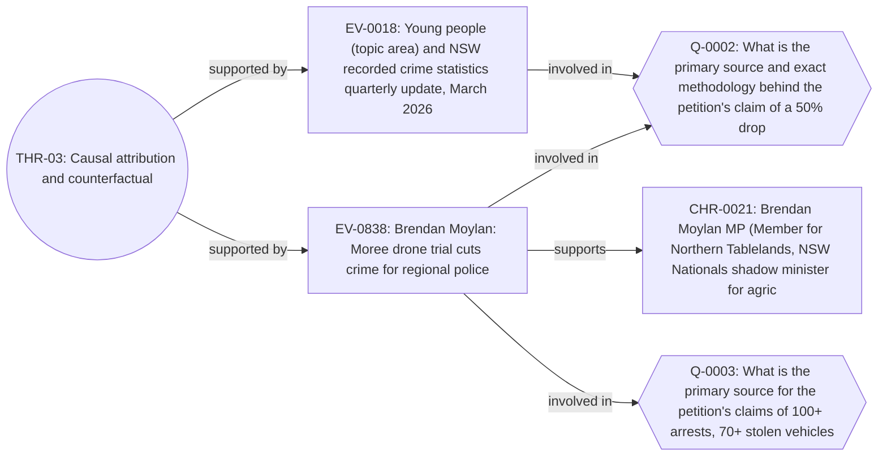
```mermaid
flowchart LR
  DFAPTI_MNC_2026_00001_THRD_THR_03(("THR-03: Causal attribution and counterfactual"))
  DFAPTI_MNC_2026_00001_EVID_EV_0018["EV-0018: Young people (topic area) and NSW recorded crime statistics quarterly update, March 2026"]
  DFAPTI_MNC_2026_00001_EVID_EV_0838["EV-0838: Brendan Moylan: Moree drone trial cuts crime for regional police"]
  DFAPTI_MNC_2026_00001_QUES_Q_0002{{"Q-0002: What is the primary source and exact methodology behind the petition's claim of a 50% drop"}}
  DFAPTI_MNC_2026_00001_CHRO_CHR_0021["CHR-0021: Brendan Moylan MP (Member for Northern Tablelands, NSW Nationals shadow minister for agric"]
  DFAPTI_MNC_2026_00001_QUES_Q_0003{{"Q-0003: What is the primary source for the petition's claims of 100+ arrests, 70+ stolen vehicles "}}
  DFAPTI_MNC_2026_00001_THRD_THR_03 -- "supported by" --> DFAPTI_MNC_2026_00001_EVID_EV_0018
  DFAPTI_MNC_2026_00001_THRD_THR_03 -- "supported by" --> DFAPTI_MNC_2026_00001_EVID_EV_0838
  DFAPTI_MNC_2026_00001_EVID_EV_0018 -- "involved in" --> DFAPTI_MNC_2026_00001_QUES_Q_0002
  DFAPTI_MNC_2026_00001_EVID_EV_0838 -- "supports" --> DFAPTI_MNC_2026_00001_CHRO_CHR_0021
  DFAPTI_MNC_2026_00001_EVID_EV_0838 -- "involved in" --> DFAPTI_MNC_2026_00001_QUES_Q_0002
  DFAPTI_MNC_2026_00001_EVID_EV_0838 -- "involved in" --> DFAPTI_MNC_2026_00001_QUES_Q_0003
```

#### THR-04 — Kempsey community-safety baseline

Status: In Progress | Completion: Not Complete

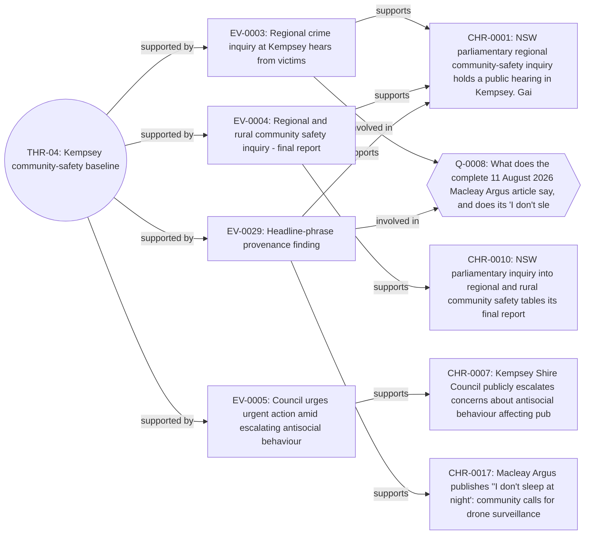
```mermaid
flowchart LR
  DFAPTI_MNC_2026_00001_THRD_THR_04(("THR-04: Kempsey community-safety baseline"))
  DFAPTI_MNC_2026_00001_EVID_EV_0003["EV-0003: Regional crime inquiry at Kempsey hears from victims"]
  DFAPTI_MNC_2026_00001_EVID_EV_0004["EV-0004: Regional and rural community safety inquiry - final report"]
  DFAPTI_MNC_2026_00001_EVID_EV_0005["EV-0005: Council urges urgent action amid escalating antisocial behaviour"]
  DFAPTI_MNC_2026_00001_EVID_EV_0029["EV-0029: Headline-phrase provenance finding"]
  DFAPTI_MNC_2026_00001_CHRO_CHR_0001["CHR-0001: NSW parliamentary regional community-safety inquiry holds a public hearing in Kempsey. Gai"]
  DFAPTI_MNC_2026_00001_QUES_Q_0008{{"Q-0008: What does the complete 11 August 2026 Macleay Argus article say, and does its 'I don't sle"}}
  DFAPTI_MNC_2026_00001_CHRO_CHR_0010["CHR-0010: NSW parliamentary inquiry into regional and rural community safety tables its final report"]
  DFAPTI_MNC_2026_00001_CHRO_CHR_0007["CHR-0007: Kempsey Shire Council publicly escalates concerns about antisocial behaviour affecting pub"]
  DFAPTI_MNC_2026_00001_CHRO_CHR_0017["CHR-0017: Macleay Argus publishes ''I don't sleep at night': community calls for drone surveillance "]
  DFAPTI_MNC_2026_00001_THRD_THR_04 -- "supported by" --> DFAPTI_MNC_2026_00001_EVID_EV_0003
  DFAPTI_MNC_2026_00001_THRD_THR_04 -- "supported by" --> DFAPTI_MNC_2026_00001_EVID_EV_0004
  DFAPTI_MNC_2026_00001_THRD_THR_04 -- "supported by" --> DFAPTI_MNC_2026_00001_EVID_EV_0005
  DFAPTI_MNC_2026_00001_THRD_THR_04 -- "supported by" --> DFAPTI_MNC_2026_00001_EVID_EV_0029
  DFAPTI_MNC_2026_00001_EVID_EV_0003 -- "supports" --> DFAPTI_MNC_2026_00001_CHRO_CHR_0001
  DFAPTI_MNC_2026_00001_EVID_EV_0003 -- "involved in" --> DFAPTI_MNC_2026_00001_QUES_Q_0008
  DFAPTI_MNC_2026_00001_EVID_EV_0004 -- "supports" --> DFAPTI_MNC_2026_00001_CHRO_CHR_0001
  DFAPTI_MNC_2026_00001_EVID_EV_0004 -- "supports" --> DFAPTI_MNC_2026_00001_CHRO_CHR_0010
  DFAPTI_MNC_2026_00001_EVID_EV_0005 -- "supports" --> DFAPTI_MNC_2026_00001_CHRO_CHR_0007
  DFAPTI_MNC_2026_00001_EVID_EV_0029 -- "supports" --> DFAPTI_MNC_2026_00001_CHRO_CHR_0001
  DFAPTI_MNC_2026_00001_EVID_EV_0029 -- "supports" --> DFAPTI_MNC_2026_00001_CHRO_CHR_0017
  DFAPTI_MNC_2026_00001_EVID_EV_0029 -- "involved in" --> DFAPTI_MNC_2026_00001_QUES_Q_0008
```

#### THR-05 — PolAir-Remote technical and operational architecture

Status: In Progress | Completion: Not Complete

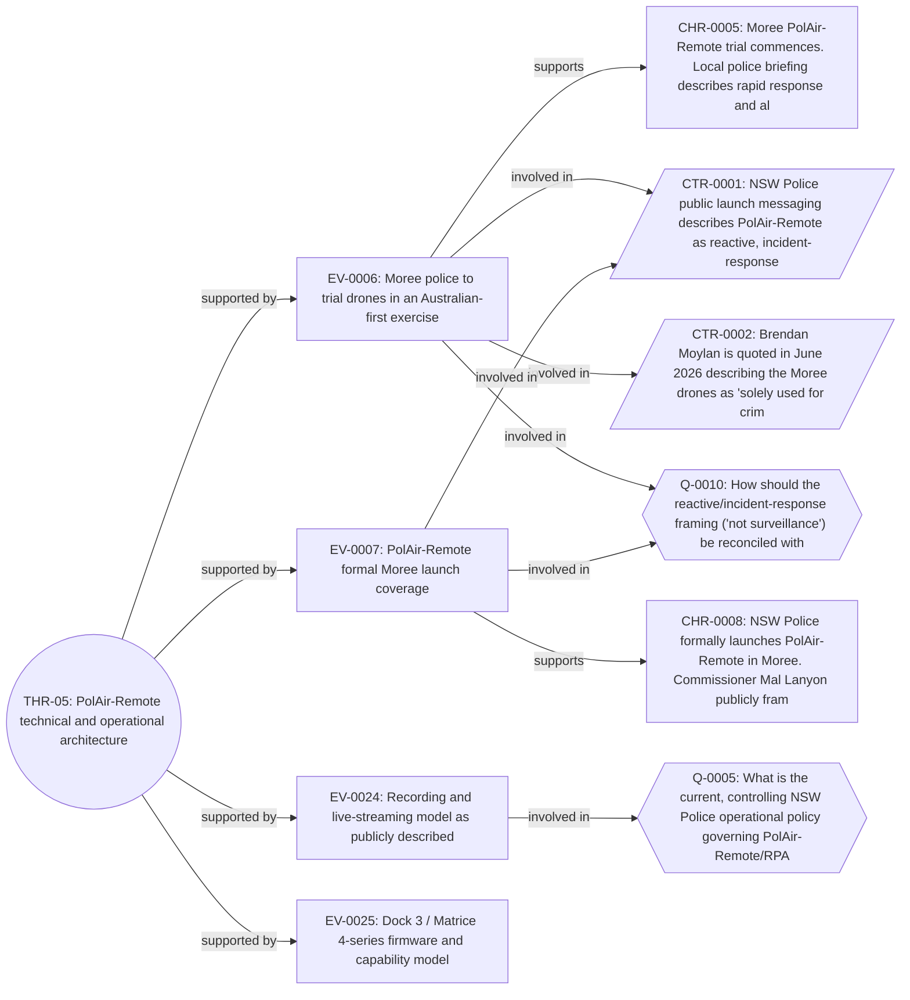
```mermaid
flowchart LR
  DFAPTI_MNC_2026_00001_THRD_THR_05(("THR-05: PolAir-Remote technical and operational architecture"))
  DFAPTI_MNC_2026_00001_EVID_EV_0006["EV-0006: Moree police to trial drones in an Australian-first exercise"]
  DFAPTI_MNC_2026_00001_EVID_EV_0007["EV-0007: PolAir-Remote formal Moree launch coverage"]
  DFAPTI_MNC_2026_00001_EVID_EV_0024["EV-0024: Recording and live-streaming model as publicly described"]
  DFAPTI_MNC_2026_00001_EVID_EV_0025["EV-0025: Dock 3 / Matrice 4-series firmware and capability model"]
  DFAPTI_MNC_2026_00001_CHRO_CHR_0005["CHR-0005: Moree PolAir-Remote trial commences. Local police briefing describes rapid response and al"]
  DFAPTI_MNC_2026_00001_CTRD_CTR_0001[/"CTR-0001: NSW Police public launch messaging describes PolAir-Remote as reactive, incident-response "/]
  DFAPTI_MNC_2026_00001_CTRD_CTR_0002[/"CTR-0002: Brendan Moylan is quoted in June 2026 describing the Moree drones as 'solely used for crim"/]
  DFAPTI_MNC_2026_00001_QUES_Q_0010{{"Q-0010: How should the reactive/incident-response framing ('not surveillance') be reconciled with "}}
  DFAPTI_MNC_2026_00001_CHRO_CHR_0008["CHR-0008: NSW Police formally launches PolAir-Remote in Moree. Commissioner Mal Lanyon publicly fram"]
  DFAPTI_MNC_2026_00001_QUES_Q_0005{{"Q-0005: What is the current, controlling NSW Police operational policy governing PolAir-Remote/RPA"}}
  DFAPTI_MNC_2026_00001_THRD_THR_05 -- "supported by" --> DFAPTI_MNC_2026_00001_EVID_EV_0006
  DFAPTI_MNC_2026_00001_THRD_THR_05 -- "supported by" --> DFAPTI_MNC_2026_00001_EVID_EV_0007
  DFAPTI_MNC_2026_00001_THRD_THR_05 -- "supported by" --> DFAPTI_MNC_2026_00001_EVID_EV_0024
  DFAPTI_MNC_2026_00001_THRD_THR_05 -- "supported by" --> DFAPTI_MNC_2026_00001_EVID_EV_0025
  DFAPTI_MNC_2026_00001_EVID_EV_0006 -- "supports" --> DFAPTI_MNC_2026_00001_CHRO_CHR_0005
  DFAPTI_MNC_2026_00001_EVID_EV_0006 -- "involved in" --> DFAPTI_MNC_2026_00001_CTRD_CTR_0001
  DFAPTI_MNC_2026_00001_EVID_EV_0006 -- "involved in" --> DFAPTI_MNC_2026_00001_CTRD_CTR_0002
  DFAPTI_MNC_2026_00001_EVID_EV_0006 -- "involved in" --> DFAPTI_MNC_2026_00001_QUES_Q_0010
  DFAPTI_MNC_2026_00001_EVID_EV_0007 -- "supports" --> DFAPTI_MNC_2026_00001_CHRO_CHR_0008
  DFAPTI_MNC_2026_00001_EVID_EV_0007 -- "involved in" --> DFAPTI_MNC_2026_00001_CTRD_CTR_0001
  DFAPTI_MNC_2026_00001_EVID_EV_0007 -- "involved in" --> DFAPTI_MNC_2026_00001_QUES_Q_0010
  DFAPTI_MNC_2026_00001_EVID_EV_0024 -- "involved in" --> DFAPTI_MNC_2026_00001_QUES_Q_0005
```

#### THR-06 — Privacy, AI and biometric governance

Status: In Progress | Completion: Not Complete

```mermaid
flowchart LR
  DFAPTI_MNC_2026_00001_THRD_THR_06(("THR-06: Privacy, AI and biometric governance"))
  DFAPTI_MNC_2026_00001_EVID_EV_0021["EV-0021: Negative-search finding: no controlling RPAS/PolAir-Remote policy in the public policy ind"]
  DFAPTI_MNC_2026_00001_EVID_EV_0022["EV-0022: Negative-search finding: no current facial-recognition use established in the PolAir-Remot"]
  DFAPTI_MNC_2026_00001_EVID_EV_0023["EV-0023: Negative-search finding: no evidence PolAir imagery has been submitted for biometric match"]
  DFAPTI_MNC_2026_00001_EVID_EV_0840["EV-0840: Police drone programs raise questions about use of AI, facial recognition"]
  DFAPTI_MNC_2026_00001_QUES_Q_0005{{"Q-0005: What is the current, controlling NSW Police operational policy governing PolAir-Remote/RPA"}}
  DFAPTI_MNC_2026_00001_QUES_Q_0006{{"Q-0006: Can PolAir-Remote imagery be, or has it ever been, submitted to facial-recognition or biom"}}
  DFAPTI_MNC_2026_00001_THRD_THR_06 -- "supported by" --> DFAPTI_MNC_2026_00001_EVID_EV_0021
  DFAPTI_MNC_2026_00001_THRD_THR_06 -- "supported by" --> DFAPTI_MNC_2026_00001_EVID_EV_0022
  DFAPTI_MNC_2026_00001_THRD_THR_06 -- "supported by" --> DFAPTI_MNC_2026_00001_EVID_EV_0023
  DFAPTI_MNC_2026_00001_THRD_THR_06 -- "supported by" --> DFAPTI_MNC_2026_00001_EVID_EV_0840
  DFAPTI_MNC_2026_00001_EVID_EV_0021 -- "involved in" --> DFAPTI_MNC_2026_00001_QUES_Q_0005
  DFAPTI_MNC_2026_00001_EVID_EV_0022 -- "involved in" --> DFAPTI_MNC_2026_00001_QUES_Q_0006
  DFAPTI_MNC_2026_00001_EVID_EV_0023 -- "involved in" --> DFAPTI_MNC_2026_00001_QUES_Q_0006
  DFAPTI_MNC_2026_00001_EVID_EV_0840 -- "involved in" --> DFAPTI_MNC_2026_00001_QUES_Q_0006
```

#### THR-07 — Procurement and statewide RPAS architecture

Status: In Progress | Completion: Not Complete

```mermaid
flowchart LR
  DFAPTI_MNC_2026_00001_THRD_THR_07(("THR-07: Procurement and statewide RPAS architecture"))
  DFAPTI_MNC_2026_00001_EVID_EV_0013["EV-0013: YR-2026-0058 - Remotely Piloted Aircraft Systems Panel (EOI)"]
  DFAPTI_MNC_2026_00001_EVID_EV_0014["EV-0014: YR-2026-0058 - closure and outstanding award status"]
  DFAPTI_MNC_2026_00001_EVID_EV_0030["EV-0030: Statewide expansion planning predates the petition"]
  DFAPTI_MNC_2026_00001_EVID_EV_0031["EV-0031: Future capability scope not frozen"]
  DFAPTI_MNC_2026_00001_EVID_EV_0032["EV-0032: Supply-chain / DJI vendor-risk consideration"]
  DFAPTI_MNC_2026_00001_EVID_EV_0038["EV-0038: YR-2026-0012 - Aviation Command Operating Model Review (EOI)"]
  DFAPTI_MNC_2026_00001_EVID_EV_0039["EV-0039: Enterprise RPAS capability planning preceded the Moree consultation's close"]
  DFAPTI_MNC_2026_00001_EVID_EV_0041["EV-0041: Negative-search finding, reconfirmed: no RPAS panel award established"]
  DFAPTI_MNC_2026_00001_EVID_EV_0839["EV-0839: YR-2026-0012 - Aviation Command Operating Model Review (EOI)"]
  DFAPTI_MNC_2026_00001_CHRO_CHR_0011["CHR-0011: NSW Police publishes procurement EOI YR-2026-0058, a statewide Remotely Piloted Aircraft S"]
  DFAPTI_MNC_2026_00001_QUES_Q_0013{{"Q-0013: What was the outcome of EOI YR-2026-0058 - was a supplier selected, and on what terms?"}}
  DFAPTI_MNC_2026_00001_CHRO_CHR_0015["CHR-0015: EOI YR-2026-0058 closes, with an estimated decision date of 20 July 2026. As at the most r"]
  DFAPTI_MNC_2026_00001_QUES_Q_0011{{"Q-0011: Has NSW Police completed a DJI-specific cyber-security, data-sovereignty or foreign-contro"}}
  DFAPTI_MNC_2026_00001_QUES_Q_0018{{"Q-0018: How does EOI YR-2026-0012 (the Aviation Command Operating Model Review) relate to PolAir-R"}}
  DFAPTI_MNC_2026_00001_CHRO_CHR_0012["CHR-0012: Moree public 'Have Your Say' consultation on the remotely piloted aircraft system runs and"]
  DFAPTI_MNC_2026_00001_QUES_Q_0015{{"Q-0015: Does consultation genuinely precede and shape deployment decisions, or does it occur only "}}
  DFAPTI_MNC_2026_00001_THRD_THR_07 -- "supported by" --> DFAPTI_MNC_2026_00001_EVID_EV_0013
  DFAPTI_MNC_2026_00001_THRD_THR_07 -- "supported by" --> DFAPTI_MNC_2026_00001_EVID_EV_0014
  DFAPTI_MNC_2026_00001_THRD_THR_07 -- "supported by" --> DFAPTI_MNC_2026_00001_EVID_EV_0030
  DFAPTI_MNC_2026_00001_THRD_THR_07 -- "supported by" --> DFAPTI_MNC_2026_00001_EVID_EV_0031
  DFAPTI_MNC_2026_00001_THRD_THR_07 -- "supported by" --> DFAPTI_MNC_2026_00001_EVID_EV_0032
  DFAPTI_MNC_2026_00001_THRD_THR_07 -- "supported by" --> DFAPTI_MNC_2026_00001_EVID_EV_0038
  DFAPTI_MNC_2026_00001_THRD_THR_07 -- "supported by" --> DFAPTI_MNC_2026_00001_EVID_EV_0039
  DFAPTI_MNC_2026_00001_THRD_THR_07 -- "supported by" --> DFAPTI_MNC_2026_00001_EVID_EV_0041
  DFAPTI_MNC_2026_00001_THRD_THR_07 -- "supported by" --> DFAPTI_MNC_2026_00001_EVID_EV_0839
  DFAPTI_MNC_2026_00001_EVID_EV_0013 -- "supports" --> DFAPTI_MNC_2026_00001_CHRO_CHR_0011
  DFAPTI_MNC_2026_00001_EVID_EV_0013 -- "involved in" --> DFAPTI_MNC_2026_00001_QUES_Q_0013
  DFAPTI_MNC_2026_00001_EVID_EV_0014 -- "supports" --> DFAPTI_MNC_2026_00001_CHRO_CHR_0015
  DFAPTI_MNC_2026_00001_EVID_EV_0014 -- "involved in" --> DFAPTI_MNC_2026_00001_QUES_Q_0013
  DFAPTI_MNC_2026_00001_EVID_EV_0030 -- "supports" --> DFAPTI_MNC_2026_00001_CHRO_CHR_0011
  DFAPTI_MNC_2026_00001_EVID_EV_0031 -- "supports" --> DFAPTI_MNC_2026_00001_CHRO_CHR_0011
  DFAPTI_MNC_2026_00001_EVID_EV_0032 -- "involved in" --> DFAPTI_MNC_2026_00001_QUES_Q_0011
  DFAPTI_MNC_2026_00001_EVID_EV_0038 -- "involved in" --> DFAPTI_MNC_2026_00001_QUES_Q_0018
  DFAPTI_MNC_2026_00001_EVID_EV_0039 -- "supports" --> DFAPTI_MNC_2026_00001_CHRO_CHR_0011
  DFAPTI_MNC_2026_00001_EVID_EV_0039 -- "supports" --> DFAPTI_MNC_2026_00001_CHRO_CHR_0012
  DFAPTI_MNC_2026_00001_EVID_EV_0039 -- "involved in" --> DFAPTI_MNC_2026_00001_QUES_Q_0015
  DFAPTI_MNC_2026_00001_EVID_EV_0041 -- "supports" --> DFAPTI_MNC_2026_00001_CHRO_CHR_0015
  DFAPTI_MNC_2026_00001_EVID_EV_0041 -- "involved in" --> DFAPTI_MNC_2026_00001_QUES_Q_0013
  DFAPTI_MNC_2026_00001_EVID_EV_0839 -- "involved in" --> DFAPTI_MNC_2026_00001_QUES_Q_0018
```

#### THR-08 — Consultation and shared governance

Status: In Progress | Completion: Not Complete

```mermaid
flowchart LR
  DFAPTI_MNC_2026_00001_THRD_THR_08(("THR-08: Consultation and shared governance"))
  DFAPTI_MNC_2026_00001_EVID_EV_0009["EV-0009: Remotely Piloted Aircraft Systems - Moree (public consultation)"]
  DFAPTI_MNC_2026_00001_EVID_EV_0011["EV-0011: Consultation / program-purpose coverage quoting Brendan Moylan"]
  DFAPTI_MNC_2026_00001_CHRO_CHR_0012["CHR-0012: Moree public 'Have Your Say' consultation on the remotely piloted aircraft system runs and"]
  DFAPTI_MNC_2026_00001_QUES_Q_0015{{"Q-0015: Does consultation genuinely precede and shape deployment decisions, or does it occur only "}}
  DFAPTI_MNC_2026_00001_CHRO_CHR_0014["CHR-0014: Moree Online News reports further consultation/program-purpose messaging, including Brenda"]
  DFAPTI_MNC_2026_00001_CTRD_CTR_0002[/"CTR-0002: Brendan Moylan is quoted in June 2026 describing the Moree drones as 'solely used for crim"/]
  DFAPTI_MNC_2026_00001_THRD_THR_08 -- "supported by" --> DFAPTI_MNC_2026_00001_EVID_EV_0009
  DFAPTI_MNC_2026_00001_THRD_THR_08 -- "supported by" --> DFAPTI_MNC_2026_00001_EVID_EV_0011
  DFAPTI_MNC_2026_00001_EVID_EV_0009 -- "supports" --> DFAPTI_MNC_2026_00001_CHRO_CHR_0012
  DFAPTI_MNC_2026_00001_EVID_EV_0009 -- "involved in" --> DFAPTI_MNC_2026_00001_QUES_Q_0015
  DFAPTI_MNC_2026_00001_EVID_EV_0011 -- "supports" --> DFAPTI_MNC_2026_00001_CHRO_CHR_0014
  DFAPTI_MNC_2026_00001_EVID_EV_0011 -- "involved in" --> DFAPTI_MNC_2026_00001_CTRD_CTR_0002
```

#### THR-09 — Political provenance and representation

Status: In Progress | Completion: Not Complete

```mermaid
flowchart LR
  DFAPTI_MNC_2026_00001_THRD_THR_09(("THR-09: Political provenance and representation"))
  DFAPTI_MNC_2026_00001_EVID_EV_0008["EV-0008: Sydney police drones chase suspects: Moree, New South Wales"]
  DFAPTI_MNC_2026_00001_EVID_EV_0015["EV-0015: Question and answer 6484 - Kempsey youth-crime KPIs and public reporting"]
  DFAPTI_MNC_2026_00001_EVID_EV_0016["EV-0016: Mr Michael Peter Kemp MP - member profile"]
  DFAPTI_MNC_2026_00001_EVID_EV_0017["EV-0017: Electorate website - top-level 'Drone Petition' link"]
  DFAPTI_MNC_2026_00001_EVID_EV_0028["EV-0028: Negative-search finding: no formal NSW Parliament petition record located"]
  DFAPTI_MNC_2026_00001_EVID_EV_0837["EV-0837: Brendan Moylan: Moree drone trial cuts crime for regional police"]
  DFAPTI_MNC_2026_00001_CHRO_CHR_0009["CHR-0009: Guardian Australia reports NSW Police Minister Yasmin Catley publicly identifying Kempsey "]
  DFAPTI_MNC_2026_00001_CHRO_CHR_0004["CHR-0004: Michael Kemp formally asks the Police Minister (NSW Parliament Q&A 6484) what metrics woul"]
  DFAPTI_MNC_2026_00001_CHRO_CHR_0006["CHR-0006: Michael Kemp becomes Shadow Parliamentary Secretary for the Prevention of Regional Crime."]
  DFAPTI_MNC_2026_00001_CHRO_CHR_0017["CHR-0017: Macleay Argus publishes ''I don't sleep at night': community calls for drone surveillance "]
  DFAPTI_MNC_2026_00001_QUES_Q_0009{{"Q-0009: Does the Kemp petition have, or is it intended to acquire, any formal NSW Parliament petit"}}
  DFAPTI_MNC_2026_00001_CHRO_CHR_0021["CHR-0021: Brendan Moylan MP (Member for Northern Tablelands, NSW Nationals shadow minister for agric"]
  DFAPTI_MNC_2026_00001_CTRD_CTR_0002[/"CTR-0002: Brendan Moylan is quoted in June 2026 describing the Moree drones as 'solely used for crim"/]
  DFAPTI_MNC_2026_00001_THRD_THR_09 -- "supported by" --> DFAPTI_MNC_2026_00001_EVID_EV_0008
  DFAPTI_MNC_2026_00001_THRD_THR_09 -- "supported by" --> DFAPTI_MNC_2026_00001_EVID_EV_0015
  DFAPTI_MNC_2026_00001_THRD_THR_09 -- "supported by" --> DFAPTI_MNC_2026_00001_EVID_EV_0016
  DFAPTI_MNC_2026_00001_THRD_THR_09 -- "supported by" --> DFAPTI_MNC_2026_00001_EVID_EV_0017
  DFAPTI_MNC_2026_00001_THRD_THR_09 -- "supported by" --> DFAPTI_MNC_2026_00001_EVID_EV_0028
  DFAPTI_MNC_2026_00001_THRD_THR_09 -- "supported by" --> DFAPTI_MNC_2026_00001_EVID_EV_0837
  DFAPTI_MNC_2026_00001_EVID_EV_0008 -- "supports" --> DFAPTI_MNC_2026_00001_CHRO_CHR_0009
  DFAPTI_MNC_2026_00001_EVID_EV_0015 -- "supports" --> DFAPTI_MNC_2026_00001_CHRO_CHR_0004
  DFAPTI_MNC_2026_00001_EVID_EV_0016 -- "supports" --> DFAPTI_MNC_2026_00001_CHRO_CHR_0006
  DFAPTI_MNC_2026_00001_EVID_EV_0017 -- "supports" --> DFAPTI_MNC_2026_00001_CHRO_CHR_0017
  DFAPTI_MNC_2026_00001_EVID_EV_0017 -- "involved in" --> DFAPTI_MNC_2026_00001_QUES_Q_0009
  DFAPTI_MNC_2026_00001_EVID_EV_0028 -- "involved in" --> DFAPTI_MNC_2026_00001_QUES_Q_0009
  DFAPTI_MNC_2026_00001_EVID_EV_0837 -- "supports" --> DFAPTI_MNC_2026_00001_CHRO_CHR_0021
  DFAPTI_MNC_2026_00001_EVID_EV_0837 -- "involved in" --> DFAPTI_MNC_2026_00001_CTRD_CTR_0002
  DFAPTI_MNC_2026_00001_EVID_EV_0837 -- "involved in" --> DFAPTI_MNC_2026_00001_QUES_Q_0009
```

#### THR-10 — Oversight and complaint architecture

Status: In Progress | Completion: Not Complete

```mermaid
flowchart LR
  DFAPTI_MNC_2026_00001_THRD_THR_10(("THR-10: Oversight and complaint architecture"))
  DFAPTI_MNC_2026_00001_EVID_EV_0026["EV-0026: Law Enforcement Conduct Commission Act 2016 (NSW) - complaint jurisdiction"]
  DFAPTI_MNC_2026_00001_EVID_EV_0027["EV-0027: Negative-search finding: no published PolAir-Remote oversight finding located"]
  DFAPTI_MNC_2026_00001_QUES_Q_0014{{"Q-0014: Has any independent oversight body (LECC, NSW IPC, NSW Ombudsman, NSW Audit Office) examin"}}
  DFAPTI_MNC_2026_00001_THRD_THR_10 -- "supported by" --> DFAPTI_MNC_2026_00001_EVID_EV_0026
  DFAPTI_MNC_2026_00001_THRD_THR_10 -- "supported by" --> DFAPTI_MNC_2026_00001_EVID_EV_0027
  DFAPTI_MNC_2026_00001_EVID_EV_0026 -- "involved in" --> DFAPTI_MNC_2026_00001_QUES_Q_0014
  DFAPTI_MNC_2026_00001_EVID_EV_0027 -- "involved in" --> DFAPTI_MNC_2026_00001_QUES_Q_0014
```

#### THR-11 — Mid North Coast rollout design

Status: In Progress | Completion: Not Complete

```mermaid
flowchart LR
  DFAPTI_MNC_2026_00001_THRD_THR_11(("THR-11: Mid North Coast rollout design"))
  DFAPTI_MNC_2026_00001_EVID_EV_0036["EV-0036: Mid North Coast Police District and Oxley electorate geographic scope"]
  DFAPTI_MNC_2026_00001_QUES_Q_0007{{"Q-0007: What deployment architecture (number and location of docks/aircraft) would a genuine 'Mid "}}
  DFAPTI_MNC_2026_00001_THRD_THR_11 -- "supported by" --> DFAPTI_MNC_2026_00001_EVID_EV_0036
  DFAPTI_MNC_2026_00001_EVID_EV_0036 -- "involved in" --> DFAPTI_MNC_2026_00001_QUES_Q_0007
```

#### THR-12 — Primary record acquisition (GIPA)

Status: In Progress | Completion: Not Complete

```mermaid
flowchart LR
  DFAPTI_MNC_2026_00001_THRD_THR_12(("THR-12: Primary record acquisition (GIPA)"))
  DFAPTI_MNC_2026_00001_EVID_EV_0034["EV-0034: Primary Record Acquisition Pack - six segmented GIPA-ready applications"]
  DFAPTI_MNC_2026_00001_EVID_EV_0035["EV-0035: External deep-research corpus: 12 snapshots, question bank, and A-T answer registers"]
  DFAPTI_MNC_2026_00001_CHRO_CHR_0018["CHR-0018: An external ChatGPT Deep Research investigation is conducted at the case operator's direct"]
  DFAPTI_MNC_2026_00001_CHRO_CHR_0019["CHR-0019: This external research corpus is ingested into the MAYHEM DFAPTI-MNC-2026-00001 case regis"]
  DFAPTI_MNC_2026_00001_THRD_THR_12 -- "supported by" --> DFAPTI_MNC_2026_00001_EVID_EV_0034
  DFAPTI_MNC_2026_00001_THRD_THR_12 -- "supported by" --> DFAPTI_MNC_2026_00001_EVID_EV_0035
  DFAPTI_MNC_2026_00001_EVID_EV_0034 -- "supports" --> DFAPTI_MNC_2026_00001_CHRO_CHR_0018
  DFAPTI_MNC_2026_00001_EVID_EV_0035 -- "supports" --> DFAPTI_MNC_2026_00001_CHRO_CHR_0018
  DFAPTI_MNC_2026_00001_EVID_EV_0035 -- "supports" --> DFAPTI_MNC_2026_00001_CHRO_CHR_0019
```

## Case: DFAPTI-BB-FF-2026-00001

62 relationship reference(s) across 12 evidence, 8 chronology, 1 contradiction, 7 open question, 6 thread record(s).

### Thread dependencies

```mermaid
flowchart LR
  DFAPTI_BB_FF_2026_00001_THRD_THR_03(("THR-03: Advocacy chain and disclosed outcomes"))
  DFAPTI_BB_FF_2026_00001_THRD_THR_02(("THR-02: The May 2025 meeting - what was actually resolved"))
  DFAPTI_BB_FF_2026_00001_THRD_THR_03 -- "depends on" --> DFAPTI_BB_FF_2026_00001_THRD_THR_02
```

### Threads

#### THR-01 — Management plan gap and grant-funding access

Status: In Progress | Completion: Not Complete

```mermaid
flowchart LR
  DFAPTI_BB_FF_2026_00001_THRD_THR_01(("THR-01: Management plan gap and grant-funding access"))
  DFAPTI_BB_FF_2026_00001_EVID_EV_0002["EV-0002: Rudder Park Flying-fox Camp Management Plan completion"]
  DFAPTI_BB_FF_2026_00001_EVID_EV_0011["EV-0011: NSW flying-fox grants program is plan-gated"]
  DFAPTI_BB_FF_2026_00001_CHRO_CHR_0002["CHR-0002: Kempsey Shire Council completes a Flying-fox Camp Management Plan for Rudder Park, East Ke"]
  DFAPTI_BB_FF_2026_00001_QUES_Q_0002{{"Q-0002: What are the exact eligibility terms of the NSW Government's flying-fox camp management gr"}}
  DFAPTI_BB_FF_2026_00001_THRD_THR_01 -- "supported by" --> DFAPTI_BB_FF_2026_00001_EVID_EV_0002
  DFAPTI_BB_FF_2026_00001_THRD_THR_01 -- "supported by" --> DFAPTI_BB_FF_2026_00001_EVID_EV_0011
  DFAPTI_BB_FF_2026_00001_EVID_EV_0002 -- "supports" --> DFAPTI_BB_FF_2026_00001_CHRO_CHR_0002
  DFAPTI_BB_FF_2026_00001_EVID_EV_0002 -- "involved in" --> DFAPTI_BB_FF_2026_00001_QUES_Q_0002
  DFAPTI_BB_FF_2026_00001_EVID_EV_0011 -- "involved in" --> DFAPTI_BB_FF_2026_00001_QUES_Q_0002
```

#### THR-02 — The May 2025 meeting - what was actually resolved

Status: In Progress | Completion: Not Complete

```mermaid
flowchart LR
  DFAPTI_BB_FF_2026_00001_THRD_THR_02(("THR-02: The May 2025 meeting - what was actually resolved"))
  DFAPTI_BB_FF_2026_00001_EVID_EV_0001["EV-0001: Bellbrook's battle with invasive flying fox camps"]
  DFAPTI_BB_FF_2026_00001_EVID_EV_0003["EV-0003: Planning docs, Councillor fees and progress on a statue for Dave Sands (May 2025 Council m"]
  DFAPTI_BB_FF_2026_00001_EVID_EV_0010["EV-0010: Resolution 2025.79 / Resolution 2025.80 (9/0 vote, defeated 2/7 amendment)"]
  DFAPTI_BB_FF_2026_00001_CHRO_CHR_0003["CHR-0003: Paul Hodgson, representing the Bellbrook Hall and Progress Association, formally presents "]
  DFAPTI_BB_FF_2026_00001_CTRD_CTR_0001[/"CTR-0001: Seven of the case's eight source documents, and the one independently-fetched press source"/]
  DFAPTI_BB_FF_2026_00001_QUES_Q_0001{{"Q-0001: What did the 20 May 2025 Kempsey Shire Council meeting actually resolve regarding Bellbroo"}}
  DFAPTI_BB_FF_2026_00001_THRD_THR_02 -- "supported by" --> DFAPTI_BB_FF_2026_00001_EVID_EV_0001
  DFAPTI_BB_FF_2026_00001_THRD_THR_02 -- "supported by" --> DFAPTI_BB_FF_2026_00001_EVID_EV_0003
  DFAPTI_BB_FF_2026_00001_THRD_THR_02 -- "supported by" --> DFAPTI_BB_FF_2026_00001_EVID_EV_0010
  DFAPTI_BB_FF_2026_00001_EVID_EV_0001 -- "supports" --> DFAPTI_BB_FF_2026_00001_CHRO_CHR_0003
  DFAPTI_BB_FF_2026_00001_EVID_EV_0001 -- "involved in" --> DFAPTI_BB_FF_2026_00001_CTRD_CTR_0001
  DFAPTI_BB_FF_2026_00001_EVID_EV_0001 -- "involved in" --> DFAPTI_BB_FF_2026_00001_QUES_Q_0001
  DFAPTI_BB_FF_2026_00001_EVID_EV_0003 -- "supports" --> DFAPTI_BB_FF_2026_00001_CHRO_CHR_0003
  DFAPTI_BB_FF_2026_00001_EVID_EV_0003 -- "involved in" --> DFAPTI_BB_FF_2026_00001_CTRD_CTR_0001
  DFAPTI_BB_FF_2026_00001_EVID_EV_0003 -- "involved in" --> DFAPTI_BB_FF_2026_00001_QUES_Q_0001
  DFAPTI_BB_FF_2026_00001_EVID_EV_0010 -- "supports" --> DFAPTI_BB_FF_2026_00001_CHRO_CHR_0003
  DFAPTI_BB_FF_2026_00001_EVID_EV_0010 -- "involved in" --> DFAPTI_BB_FF_2026_00001_CTRD_CTR_0001
  DFAPTI_BB_FF_2026_00001_EVID_EV_0010 -- "involved in" --> DFAPTI_BB_FF_2026_00001_QUES_Q_0001
```

#### THR-03 — Advocacy chain and disclosed outcomes

Status: In Progress | Completion: Not Complete

```mermaid
flowchart LR
  DFAPTI_BB_FF_2026_00001_THRD_THR_03(("THR-03: Advocacy chain and disclosed outcomes"))
  DFAPTI_BB_FF_2026_00001_EVID_EV_0004["EV-0004: Kempsey Shire Council written advocacy update to Bellbrook residents"]
  DFAPTI_BB_FF_2026_00001_EVID_EV_0005["EV-0005: Absence of Bellbrook flying-fox item from October 2025 council agenda"]
  DFAPTI_BB_FF_2026_00001_EVID_EV_0006["EV-0006: Council Submission - Bellbrook Flying Fox, June 2026"]
  DFAPTI_BB_FF_2026_00001_EVID_EV_0007["EV-0007: Ombudsman Complaint - Bellbrook Flying Fox, June 2026"]
  DFAPTI_BB_FF_2026_00001_CHRO_CHR_0007["CHR-0007: Kempsey Shire Council issues a written advocacy update to affected Bellbrook residents, si"]
  DFAPTI_BB_FF_2026_00001_QUES_Q_0003{{"Q-0003: Has the 18 March 2026 council letter to Bellbrook residents (EV-0004) been independently o"}}
  DFAPTI_BB_FF_2026_00001_CHRO_CHR_0006["CHR-0006: October 2025 ordinary council meeting held. No item on Bellbrook flying-fox management app"]
  DFAPTI_BB_FF_2026_00001_QUES_Q_0001{{"Q-0001: What did the 20 May 2025 Kempsey Shire Council meeting actually resolve regarding Bellbroo"}}
  DFAPTI_BB_FF_2026_00001_CHRO_CHR_0008["CHR-0008: Formal submissions drafted for simultaneous lodgement with Kempsey Shire Council, the NSW "]
  DFAPTI_BB_FF_2026_00001_QUES_Q_0005{{"Q-0005: Have any of the drafted formal submissions (council letter, Ombudsman complaint, senator l"}}
  DFAPTI_BB_FF_2026_00001_THRD_THR_03 -- "supported by" --> DFAPTI_BB_FF_2026_00001_EVID_EV_0004
  DFAPTI_BB_FF_2026_00001_THRD_THR_03 -- "supported by" --> DFAPTI_BB_FF_2026_00001_EVID_EV_0005
  DFAPTI_BB_FF_2026_00001_THRD_THR_03 -- "supported by" --> DFAPTI_BB_FF_2026_00001_EVID_EV_0006
  DFAPTI_BB_FF_2026_00001_THRD_THR_03 -- "supported by" --> DFAPTI_BB_FF_2026_00001_EVID_EV_0007
  DFAPTI_BB_FF_2026_00001_EVID_EV_0004 -- "supports" --> DFAPTI_BB_FF_2026_00001_CHRO_CHR_0007
  DFAPTI_BB_FF_2026_00001_EVID_EV_0004 -- "involved in" --> DFAPTI_BB_FF_2026_00001_QUES_Q_0003
  DFAPTI_BB_FF_2026_00001_EVID_EV_0005 -- "supports" --> DFAPTI_BB_FF_2026_00001_CHRO_CHR_0006
  DFAPTI_BB_FF_2026_00001_EVID_EV_0005 -- "involved in" --> DFAPTI_BB_FF_2026_00001_QUES_Q_0001
  DFAPTI_BB_FF_2026_00001_EVID_EV_0006 -- "supports" --> DFAPTI_BB_FF_2026_00001_CHRO_CHR_0008
  DFAPTI_BB_FF_2026_00001_EVID_EV_0006 -- "involved in" --> DFAPTI_BB_FF_2026_00001_QUES_Q_0005
  DFAPTI_BB_FF_2026_00001_EVID_EV_0007 -- "supports" --> DFAPTI_BB_FF_2026_00001_CHRO_CHR_0008
  DFAPTI_BB_FF_2026_00001_EVID_EV_0007 -- "involved in" --> DFAPTI_BB_FF_2026_00001_QUES_Q_0005
```

#### THR-04 — Available management actions vs. the legal-protection framing

Status: In Progress | Completion: Not Complete

```mermaid
flowchart LR
  DFAPTI_BB_FF_2026_00001_THRD_THR_04(("THR-04: Available management actions vs. the legal-protection framing"))
  DFAPTI_BB_FF_2026_00001_EVID_EV_0012["EV-0012: Level 1/Level 2 management actions available without a licence"]
  DFAPTI_BB_FF_2026_00001_QUES_Q_0007{{"Q-0007: What does the actual text of the NSW Flying-fox Camp Management Code of Practice 2018 say "}}
  DFAPTI_BB_FF_2026_00001_THRD_THR_04 -- "supported by" --> DFAPTI_BB_FF_2026_00001_EVID_EV_0012
  DFAPTI_BB_FF_2026_00001_EVID_EV_0012 -- "involved in" --> DFAPTI_BB_FF_2026_00001_QUES_Q_0007
```

#### THR-05 — Health risk - droppings exposure and histoplasmosis

Status: In Progress | Completion: Not Complete

```mermaid
flowchart LR
  DFAPTI_BB_FF_2026_00001_THRD_THR_05(("THR-05: Health risk - droppings exposure and histoplasmosis"))
  DFAPTI_BB_FF_2026_00001_EVID_EV_0008["EV-0008: Bellbrook Flying-Fox Droppings — What's Actually Established"]
  DFAPTI_BB_FF_2026_00001_QUES_Q_0006{{"Q-0006: Has any local Bellbrook resident sought medical care for symptoms consistent with histopla"}}
  DFAPTI_BB_FF_2026_00001_THRD_THR_05 -- "supported by" --> DFAPTI_BB_FF_2026_00001_EVID_EV_0008
  DFAPTI_BB_FF_2026_00001_EVID_EV_0008 -- "involved in" --> DFAPTI_BB_FF_2026_00001_QUES_Q_0006
```

#### THR-06 — Camp classification - documented status vs. functional reality

Status: In Progress | Completion: Not Complete

```mermaid
flowchart LR
  DFAPTI_BB_FF_2026_00001_THRD_THR_06(("THR-06: Camp classification - documented status vs. functional reality"))
  DFAPTI_BB_FF_2026_00001_EVID_EV_0009["EV-0009: Council website classification of Bellbrook camp as 'historic'"]
  DFAPTI_BB_FF_2026_00001_QUES_Q_0004{{"Q-0004: Does Kempsey Shire Council's website, or the NSW Government's Flying-fox Camp Database, ac"}}
  DFAPTI_BB_FF_2026_00001_THRD_THR_06 -- "supported by" --> DFAPTI_BB_FF_2026_00001_EVID_EV_0009
  DFAPTI_BB_FF_2026_00001_EVID_EV_0009 -- "involved in" --> DFAPTI_BB_FF_2026_00001_QUES_Q_0004
```
